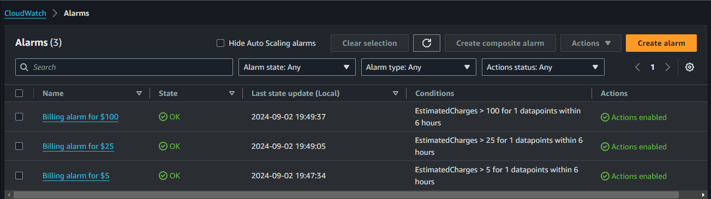

# BIL01-AWS100 — Create three Billing Alarms

## Cloud Service Provider
* Amazon Web Services (AWS)

## Difficulty
Level 100 (Introductory)

## Project's Author(s)
* [Chris Nagy](https://twitter.com/chris_the_nagy)

## Objectives

###  You need to complete the following:

* Create a billing alarm for $5
* Create a billing alarm for $25
* Create a billing alarm for $100

###  You need to answer the following: 

### ***1. How many billing alarms do you get for free?***

We can create up to 10 billing alarms for free as part of the AWS Free Tier.

### ***2. When a billing alarm is triggered how will you know?***

When a billing alarm is triggered, we will receive a notification via Amazon Simple Notification Service (SNS). This can be configured to send alerts through email, SMS, or other endpoints.

### ***3. What is the difference between a billing alarm and a cloudwatch alarm?***

* **Billing Alarm:** Specifically monitors your AWS account’s estimated charges. It triggers when your charges exceed a specified threshold. Billing alarms are based on billing data and are used to help manage and control costs.

* **CloudWatch Alarm:** Monitors a variety of metrics related to AWS resources and applications, such as CPU usage, memory usage, and custom metrics. These alarms can trigger actions like sending notifications or automatically scaling resources based on the defined thresholds

## References

* [Creating a Billing Alarm to Monitor Your Estimated AWS Charges](https://docs.aws.amazon.com/AmazonCloudWatch/latest/monitoring/monitor_estimated_charges_with_cloudwatch.html)

## Output

