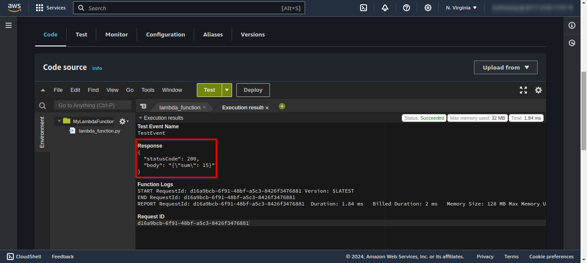

# LES01-AWS100 - Create a Lambda Function to Add Two Numbers
## Cloud Service Provider
- Amazon Web Services

## Difficulty
- Level 100 (Introductory)

## Project's Author(s)

- [Syed Auther](https://twitter.com/syedauther)

## Objectives

### You need to complete the following:
- Create an AWS Lambda with a language of your choice to add 2 numbers supplied as input and return the result.
- Print the result out in the logs.

### You need to answer the following:

### ***What is Function as a service?***

Function as a Service (FaaS) is a cloud computing service that allows developers to execute small, independent pieces of code (functions) in response to events without managing the underlying infrastructure. AWS Lambda is the most notable FaaS offered by Amazon Web Services (AWS). With FaaS, you write your code, and the cloud provider automatically provisions the necessary compute resources, handles scaling, and manages execution. You are charged only for the time your code runs, making it highly cost-effective.

### ***How many languages are supported by AWS Lambda***

AWS Lambda supports several programming languages, including:

- **Node.js** (JavaScript)
- **Python**
- **Ruby**
- **Java (8 and 11)**
- **Go**
- **C# (.NET Core)**
- **PowerShell** Additionally, Lambda allows custom runtimes, meaning developers can bring their own runtime to run code in any programming language by packaging it as a Lambda layer.

### ***What is the maximum memory allocated to an AWS Lambda function?***

The maximum memory allocation for an AWS Lambda function is **10,240 MB (10 GB)**. Memory can be configured in 64 MB increments, starting from a minimum of **128 MB**.

### ***How many ways to deploy a Lambda function?***

You can deploy an AWS Lambda function using several methods:

- **AWS Management Console:** Upload your code directly via the web interface.
- **AWS CLI (Command Line Interface):** Use commands like `aws lambda create-function` or `update-function-code` to deploy.
- **AWS SDKs:** Automate deployment using SDKs like boto3 (Python), AWS SDK for JavaScript, etc.
- **AWS SAM (Serverless Application Model):** Use SAM CLI to package and deploy serverless applications, including Lambda.
- **CloudFormation:** Use AWS’s Infrastructure as Code (IaC) service to deploy Lambda functions via templates.
- **AWS CodePipeline/CodeDeploy:** Automate continuous integration and deployment (CI/CD) for Lambda functions.

### ***How to write code in the cloud9 IDE?***

AWS Cloud9 is an online integrated development environment (IDE) that allows developers to write, run, and debug code in the cloud. Here's how to write code in Cloud9:

1. **Open AWS Cloud9:** From the AWS Management Console, navigate to Cloud9.
2. **Create a new environment:** Set up a new Cloud9 development environment with a linked EC2 instance or your local server.
3. **Write Code:** Once the environment is created, a text editor opens where you can start coding in various languages such as Python, JavaScript, or Node.js.
4. **Install Packages:** You can install additional libraries or dependencies using a terminal provided within Cloud9.
5. **Run Code:** You can run your code directly from the IDE using the built-in terminal or running scripts inside the IDE.

### ***How to test a Lambda function?***

To test an AWS Lambda function:

1. **From AWS Console:**

   - Go to the AWS Lambda Console and select the function you want to test.
   - In the function editor, click on the "Test" button.
   - Create a new test event by selecting a predefined event template or creating a custom JSON payload for the event.
   - After creating the test event, run the test, and AWS Lambda will invoke the function using the event input.
   - View the results (success/failure) and execution logs on the same screen.

2. **From AWS CLI:**

	- Use the `aws lambda invoke` command to test the Lambda function with a specific payload.

3. **From the IDE (Cloud9, VS Code):**

	- Use AWS SDKs or SAM CLI to invoke and test Lambda functions locally using mock events.

### ***What is cloudwatch?***

Amazon CloudWatch is a monitoring and observability service provided by AWS that allows you to collect, track, and analyze metrics, logs, and events from various AWS resources (like EC2, Lambda, RDS). CloudWatch helps in:

  - **Monitoring system performance** (CPU usage, memory, etc.).
  - **Setting alarms** for various thresholds (e.g., alerting when CPU usage crosses a certain threshold).
  - **Log collection:** It aggregates logs from services such as Lambda, EC2, and API Gateway into a central repository.

### ***How to check the logs for a Lambda function?***

You can check AWS Lambda logs via Amazon CloudWatch Logs:

1. **Via AWS Console:**

	- Navigate to **CloudWatch** in the AWS Console.
 	- Under **Logs**, search for your Lambda function’s log group (it’s usually in the format `/aws/lambda/<function-name>`).
 	- Inside the log group, you'll find individual log streams representing the execution of your Lambda function.
 	- Open a log stream to see detailed logs, including invocation details, execution time, and any errors.

2. **Via AWS CLI:**

	- You can retrieve logs from the command line using the `aws logs` command.
 	- Example: aws logs tail `/aws/lambda/<function-name> --follow`

3. **From the Lambda Console:**

   - Open your Lambda function in the AWS Console.
   - Scroll down to the **Monitoring** tab, and click on **View Logs in CloudWatch.**
   - This will take you directly to the relevant log group in CloudWatch for that specific Lambda function.

These logs provide valuable information for debugging and performance optimization.

## References
- [AWS Lambda- Getting Started](https://aws.amazon.com/lambda/getting-started/)
- [AWS Cloudwatch logs](https://docs.aws.amazon.com/AmazonCloudWatch/latest/logs/WhatIsCloudWatchLogs.html)
- [Check AWS Lambda logs](https://docs.aws.amazon.com/lambda/latest/dg/monitoring-cloudwatchlogs.html)
- [How to test an AWS Lambda function](https://docs.aws.amazon.com/lambda/latest/dg/getting-started-create-function.html)

## Estimated Cost
- The AWS Lambda free usage tier includes **1M free requests per month and 400,000 GB-seconds of compute time per month**, so feel free to explore unhinged! 

## Estimated Time
- 10 minutes 

## Ideas
- Just create a Lambda function with default settings and choose the language you want to code in, and it give you a starter hello world template , with 2 input parameters event and context,from which event will have the input data that you pass in your test call. 

## Tips
- Use the cloud9 IDE to code the hello world Lambda initially, and then explore other deployment ideas like zip file uploads and SAM deployments

## Output

