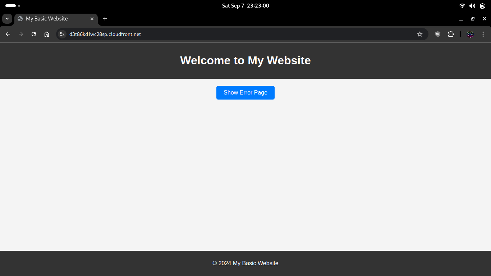

# NET04-AWS100 — Host a simple static webpage with S3 and CloudFront

## Cloud Service Provider
* Amazon Web Services (AWS)

## Difficulty
Level 100 (Introductory)

## Project's Author(s)
* [Antonio Lo Fiego](https://twitter.com/antonio_lofiego)

## Objectives

###  You need to complete the following:

* Create an S3 bucket and upload a simple static webpage
* Create a CloudFront distribution and use the S3 bucket as origin
* Make sure that the bucket's content can be accessed only through the CloudFront endpoint

###  You need to answer the following: 

### ***What is the benefit of using a CDN?***

A Content Delivery Network (CDN) such as Amazon CloudFront provides several benefits when used in conjunction with AWS services like S3:

- **Reduced Latency:** A CDN caches content at edge locations closer to users, which reduces the round-trip time and improves the speed of content delivery.
- **Improved Performance:** By distributing the load across multiple servers at edge locations, a CDN can serve content faster and more efficiently, especially for global users.
- **Scalability:** CDNs can handle large amounts of traffic by spreading requests across numerous edge locations, ensuring content remains available during traffic spikes.
- **Security:** AWS CloudFront offers integration with AWS Shield and AWS WAF for DDoS protection and web application firewall (WAF) capabilities, improving security.
- **Cost-Effectiveness:** Serving content from edge locations reduces the load on the origin server (e.g., an S3 bucket), which can reduce bandwidth and request costs.
- **Content Caching:** CloudFront caches static and dynamic content, reducing the need to retrieve it from the origin server frequently.

### ***How would you explain Bucket Policies?***

Bucket Policies are JSON-based access control rules used to define permissions for an entire Amazon S3 bucket or specific objects within it. These policies allow or deny access to the bucket based on various conditions.

Key aspects of Bucket Policies:

- **Permissions Control:** You can specify which AWS accounts or IAM users/groups can perform actions like `GetObject`, `PutObject`, or `DeleteObject` on the bucket.
- **Granular Access Control:** Policies can define access control at different levels, such as bucket-wide permissions or specific objects.
- **Conditional Access:** Bucket policies can include conditions, such as IP address restrictions, VPC endpoint restrictions, or multi-factor authentication requirements.
- **Cross-Account Access:** You can grant access to S3 resources to other AWS accounts using Bucket Policies.
- **IAM Integration:** They work alongside IAM policies and Access Control Lists (ACLs) to enforce security at various levels.

### ***What are the ways to secure access on a CDN-fronted S3 bucket?***

To secure access to an S3 bucket that is fronted by a CDN (like AWS CloudFront), the following techniques can be applied:

1. **Use Origin Access Control (OAC) or Origin Access Identity (OAI):**

    - **OAC (Preferred):** Origin Access Control (OAC) allows CloudFront to securely access your S3 bucket without making the bucket public. Only CloudFront is allowed to fetch content from the bucket.
    - **OAI:** Origin Access Identity (OAI) is an older method that creates a unique CloudFront identity, which is granted permission to access objects in your S3 bucket.

2. **Bucket Policy Restrictions:**

    - Use bucket policies that only allow access from CloudFront's OAC or OAI. This prevents direct access to S3 objects from the internet.
    - Example of bucket policy for CloudFront:
```json
{
  "Version": "2012-10-17",
  "Statement": [
    {
      "Effect": "Allow",
      "Principal": {
        "Service": "cloudfront.amazonaws.com"
      },
      "Action": "s3:GetObject",
      "Resource": "arn:aws:s3:::your-bucket-name/*",
      "Condition": {
        "StringEquals": {
          "AWS:SourceArn": "arn:aws:cloudfront::account-id:distribution/distribution-id"
        }
      }
    }
  ]
}
```

3. **Signed URLs and Signed Cookies:**

    - Generate **signed URLs** or **signed cookies** to control who can access the content. This ensures that only users with valid credentials or permissions can download the objects.
    - Signed URLs are typically used for granting temporary access to individual files, while signed cookies are better for granting access to multiple objects.

4. **HTTPS Enforcement:**

    - Ensure that the communication between CloudFront and the client, as well as between CloudFront and the S3 origin, is encrypted using HTTPS. CloudFront allows you to enforce HTTPS-only access.

5. **Restrict Viewer Access by IP:**

    - Use CloudFront’s geo-restriction or IP-based restriction to limit access to specific regions or IP ranges.


6. **AWS Web Application Firewall (WAF):**

    - Integrate AWS WAF with CloudFront to filter incoming traffic based on specific patterns (e.g., SQL injection attempts or IP blacklist) and block malicious users.

7. **Logging and Monitoring:**

    - Enable CloudFront and S3 access logging to monitor who is accessing your content.
    - Use AWS CloudTrail for auditing access and ensuring that security policies are being enforced as expected.

## References

* [Working with Distributions](https://docs.aws.amazon.com/AmazonCloudFront/latest/DeveloperGuide/distribution-working-with.html)
* [Hosting a static website on S3](https://docs.aws.amazon.com/AmazonS3/latest/dev/WebsiteHosting.html)

## Costs
- Included in the Free Tier

## Estimated time to complete
- 5 minutes

## Output

