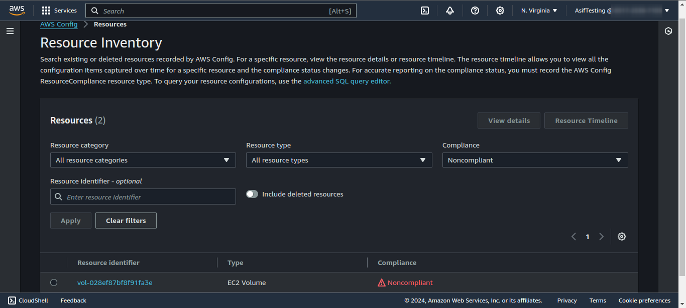

# SEC02-AWS100 — Use a managed Config Rule

## Cloud Service Provider
- Amazon Web Services

## Difficulty

- Level 100 (Introductory)

## Project's Author(s)

- [Andrew Brown](https://twitter.com/andrewbrown)

## Objectives

### You need to complete the following:

- Turn on AWS Config in the US-EAST-1 region
- Choose the managed Config rule eg. encrypted-volumes
- Launch an EC2 instance without an encryped EBS volume
- Monitor AWS Config until it detects there is an EBS volume that is unencrpyted

### You need to answer the following:

### ***What is AWS Config?***

**AWS Config** is a fully managed service that enables you to assess, audit, and evaluate the configurations of your AWS resources. It helps in recording the configuration changes and relationships between AWS resources over time. By continuously monitoring and storing the configuration history, AWS Config provides insights into how resources were configured, helping to track compliance with organizational policies, security standards, and best practices.

### ***What does an AWS Config rule do?***

An AWS Config rule is a custom or managed policy used to evaluate whether specific AWS resource configurations comply with the desired settings or best practices. These rules are either predefined by AWS (managed rules) or created by the user (custom rules using AWS Lambda). The rule continuously monitors AWS resource configurations and checks whether they adhere to certain compliance conditions.

### ***What is remediation in the context of a config rule?***

**Remediation** in AWS Config refers to the process of automatically or manually correcting non-compliant resources identified by Config rules. Once a rule detects that a resource is non-compliant (not following the required configuration), remediation can be triggered to bring the resource back into compliance. AWS Config supports **automatic remediation** using pre-defined actions, often through **AWS Systems Manager Automation Documents (SSM documents)** or other automation workflows`

## References

- [AWS Config](https://aws.amazon.com/config/)
- [List of AWS Config Managed Rules](https://docs.aws.amazon.com/config/latest/developerguide/managed-rules-by-aws-config.html)

## Costs
- Included in the Free Tier

## Estimated time to complete
- 10 minutes

## Output

