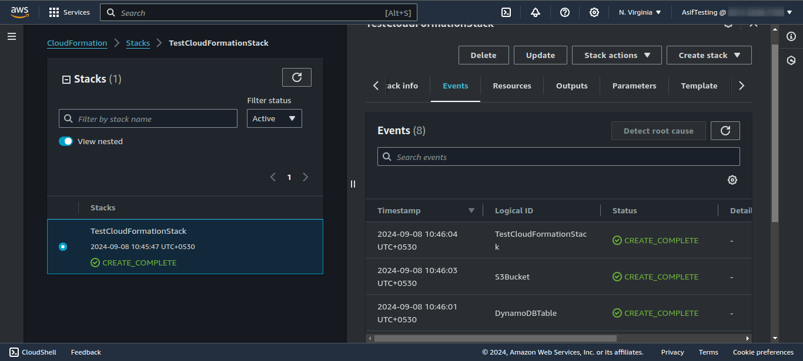

# OPS01-AWS100 — Deploy a CloudFormation template from the AWS Console

## Cloud Service Provider

- Amazon Web Services

## Difficulty

- Level 100 (Introductory)

## Project's Author(s)
- [Syed Auther](https://twitter.com/syedauther)
- [Chris Nagy](https://twitter.com/chris_the_nagy)

## Objectives

### You need to complete the following:

- Download our simple, pre-made [CloudFormation template](./OPS01-AWS100-CFTEMPLATE.yaml?raw=true)
- Go to the CloudFormation Console in AWS
- Choose _create stack with new resources_ and use the template file from above
- At the _"Configure stack options"_ page, leave everything on default
- Watch as CloudFormation deploys the resources, check the _events_ tab to see what is being created
- Make sure that there is a new DynamoDB Table, and a new S3 bucket deployed
- Delete the stack in the CloudFormation console
- Make sure both resources got deleted

### You need to answer the following: 

### ***What is Infrastructure as Code (IaC)?***

**Infrastructure as Code (IaC)** is the practice of managing and provisioning computing infrastructure using machine-readable configuration files rather than physical hardware or manual configuration tools. In the cloud, this means you can automate the provisioning of services like networks, virtual machines, and storage through code, ensuring consistency and efficiency. IaC allows for version control, reproducibility, and automated deployments, making infrastructure management easier and more reliable.

### ***What is CloudFormation?***

**AWS CloudFormation** is a service that provides IaC by allowing users to define and provision AWS infrastructure resources in a consistent and automated way using declarative templates. CloudFormation interprets these templates and creates, updates, or deletes AWS resources as specified. This simplifies the process of provisioning and managing AWS resources and reduces human error.

### ***What is a CloudFormation template?***

A **CloudFormation template** is a JSON or YAML file that defines the AWS resources you want to provision and manage. These templates are declarative, meaning they describe the desired state of the resources rather than specifying commands to provision them. Templates contain sections such as:

 - **Resources:** The actual AWS services you want to create.
 - **Parameters:** Input values to customize the template.
 - **Outputs:** Information returned after resources are created.
 - **Conditions and Mappings:** To control resource creation based on circumstances.

### ***In what two file formats can a CloudFormation template be specified?***

A **CloudFormation template** can be specified in:

  - **JSON** (JavaScript Object Notation)
  - **YAML** (YAML Ain't Markup Language)

### ***What is a CloudFormation stack?***

A **CloudFormation stack** is a collection of AWS resources that are created, managed, and deleted as a single unit. A stack is created from a CloudFormation template, and it provisions and configures all of the AWS resources defined within that template. You can manage and update the stack as a whole, ensuring consistency across resources.

### ***Can the same template be used in other regions?***

Yes, the same **CloudFormation template** can be used in other AWS regions. However, it's important to ensure that the AWS services and resources defined in the template are available in the region you're deploying to.

### ***What happens to the deployed resources when the stack gets deleted?***

When a **CloudFormation stack** is deleted, all the resources associated with the stack are also deleted by default, unless you explicitly specify retention policies for certain resources. If the resources were created as part of the stack, deleting the stack will generally remove those resources. However, any data stored in services like Amazon S3 buckets or RDS databases could potentially be lost unless you configure the template to retain them.

## References

- [CloudFormation Introduction](https://www.youtube.com/watch?v=GeERpAAKCsQ&list=PLBfufR7vyJJ6FhBhJJSaMkI-m2wyoPy-G&index=200)
- [AWS - Deploy a CloudFormation stack](https://docs.aws.amazon.com/AWSCloudFormation/latest/UserGuide/GettingStarted.Walkthrough.html#GettingStarted.Walkthrough.createstack)
- [CloudFormation Template structure](https://www.youtube.com/watch?v=NhQhltDp1o4&list=PLBfufR7vyJJ6FhBhJJSaMkI-m2wyoPy-G&index=202)

## Costs
- This project is included in the free tier
- There is no additional charge for using AWS CloudFormation. You do pay however for AWS resources (e.g. EC2 instances, S3 buckets) created by CloudFormation as if you created them by hand.

## Estimated time to complete
- 10 minutes

## Output

