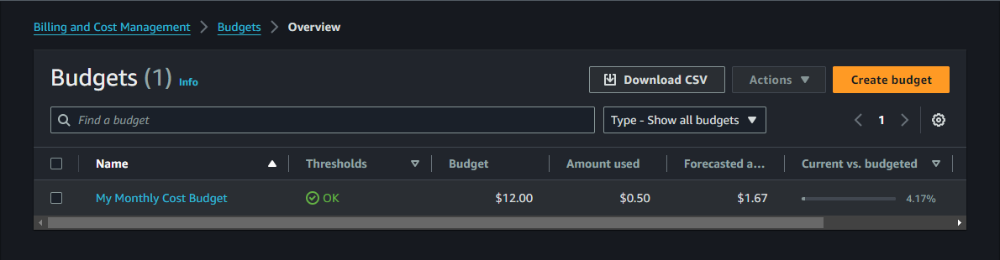

# BIL02-AWS100 — Create a Cost Budget

## Cloud Service Provider
* Amazon Web Services (AWS)

## Difficulty
Level 100 (Introductory)

## Estimated Time
* 20 - 40 minutes 
  
## Project's Author(s)
* [Ariela](https://twitter.com/ari_hacks)

## Objectives

###  You need to complete the following:

* Create a cost budget 

###  You need to answer the following: 

### ***1. In order for IAM users to create budgets in the Billing and Cost Management console what else must these users be allowed to do?***

In order for IAM users to create budgets in the Billing and Cost Management console, we must have permissions to access the AWS Billing and Cost Management service. Specifically, we need the following permissions:

* **budgets:CreateBudget** to create budgets.
* **billing:ViewBilling** to view billing information.
* **budgets:ViewBudget** to view budgets (useful for managing budgets).

These permissions are typically part of the **AWSBillingReadOnlyAccess** or **AWSBudgetsActionsPolicy** policies.

### ***2. In addition to the console how else can you create budgets?***

Besides using the AWS Management Console, we can create budgets using the following methods:

* **AWS CLI (Command Line Interface):** We can use the create-budget command within the AWS CLI.
* **AWS SDKs:** We can programmatically create budgets using AWS SDKs (e.g., SDKs for Python, Java, .NET, etc.).
* **AWS CloudFormation:** We can define budgets as part of our infrastructure as code (IaC) using CloudFormation templates.
* **AWS API:** We can directly use the AWS Budgets API to create and manage budgets. 

### ***3. Is it better to set budgets on a recurring basis or for a specific time? And why?***

Recurring budgets are better for maintaining a long-term overview of our costs and ensuring ongoing cost control. They provide alerts and visibility into our spending trends, which can help us adjust our usage and optimize our costs over time.

### ***4. What are the different types of costs that make up a cost budget?***

The different types of costs that make up a cost budget in AWS include:
* **Cost budgets** – Plan how much you want to spend on a service.
* **Usage budgets** – Plan how much you want to use one or more services.
* **RI utilization budgets** – Define a utilization threshold and receive alerts when your RI usage falls below that threshold. This lets you see if your RIs are unused or under-utilized.
* **RI coverage budgets** – Define a coverage threshold and receive alerts when the number of your instance hours that are covered by RIs fall below that threshold. This lets you see how much of your instance usage is covered by a reservation.
* **Savings Plans utilization budgets** – Define a utilization threshold and receive alerts when the usage of your Savings Plans falls below that threshold. This lets you see if your Savings Plans are unused or under-utilized.
* **Savings Plans coverage budgets** – Define a coverage threshold and receive alerts when your Savings Plans eligible usage that is covered by Savings Plans fall below that threshold. This lets you see how much of your instance usage is covered by Savings Plans.

### ***5. What are the different options for setting budget alerts?***

AWS Budgets provides several options for setting budget alerts:

* **Threshold Alerts:** You can set alerts when your actual or forecasted costs exceed a certain percentage of your budget (e.g., 50%, 80%, 100%).
* **Usage Alerts:** Alerts can be set based on your usage (e.g., if you exceed a specific amount of resources like EC2 hours).
* **Cost Type Alerts:** You can create alerts based on specific cost types, such as only for a particular service or linked account.
* **Notification Channels:** Alerts can be sent via email, SMS, or via Amazon SNS to trigger other automated actions.
* **Multiple Alert Levels:** You can set multiple alert thresholds within a single budget to receive notifications at different stages (e.g., 70%, 90%, 100%).
  
## References

* [Create a cost budget](https://docs.aws.amazon.com/awsaccountbilling/latest/aboutv2/budgets-create.html#create-cost-budget)
* [Best practices](https://docs.aws.amazon.com/awsaccountbilling/latest/aboutv2/budgets-best-practices.html)

## Costs
- Included in the Free Tier

## Estimated time to complete
- 1 minutes

## Output

