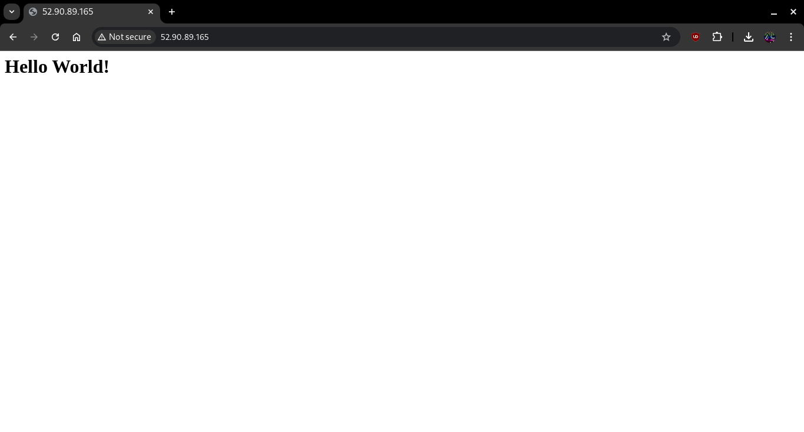

# COM03-AWS100 - Launch a Hello World website on the internet

## Cloud Service Provider
- Amazon Web Services

## Difficulty
- Level 100 (Introductory)

## Project's Author(s)

[Syed Auther](https://twitter.com/syedauther)

## Objectives

### You need to complete the following:
- Launch a linux based EC2 instance in any one region of your choice in a public subnet 
- Setup a security group that allows http/https connections from the Internet, and ssh from your IP address
- ssh into the EC2 instance
- setup a webserver on the EC2 instance
- add a simple hello world header to the index.html file 
- Hit the public IP address from a browser and confirm the site is served


### You need to answer the following:
### ***1. What is a region?***

An AWS region is a geographical location where Amazon Web Services (AWS) hosts data centers. Each region consists of multiple, isolated locations known as Availability Zones. AWS Regions are designed to be physically separate from each other to offer reliability and fault tolerance for applications hosted within them. Examples include `us-east-1` (North Virginia), `eu-west-1` (Ireland), and `ap-south-1` (Mumbai).

### ***2. What is an availability zone?***

An Availability Zone (AZ) is a physically isolated data center within an AWS region. Each region typically has two or more Availability Zones, and they are connected via low-latency links. AZs are designed to provide high availability and fault tolerance by allowing you to run applications across multiple zones within a region. For example, in `us-east-1`, you have AZs like `us-east-1a`, `us-east-1b`, etc.

### ***3. What is a public subnet?***

A public subnet is a subnet within a Virtual Private Cloud (VPC) whose instances can directly communicate with the internet via an Internet Gateway (IGW). Public subnets typically have a route table that includes a route to the IGW, making them accessible from the public internet.

### ***4. How many subnets can there be in one region?***

The number of subnets in a region depends on the VPC size and the available IP address range. For example, within a VPC, you can create as many subnets as your CIDR block supports. The default limit for subnets per VPC is 200, but this can be increased by submitting a request to AWS.

### ***5. How to launch EC2 instances in public / private subnets?***

To launch EC2 instances in public or private subnets:

**Public Subnet:**
- Go to the EC2 dashboard.
- Select "Launch Instance."
- Choose an AMI and instance type.
- Select the VPC and the public subnet.
- Ensure "Auto-assign Public IP" is enabled.
- Configure security groups to allow inbound traffic (e.g., HTTP, SSH).
- Launch the instance.

**Private Subnet:**
- Follow the same steps as above, but select the private subnet.
- Do not enable "Auto-assign Public IP."
- Ensure that the instance can access the internet through a NAT Gateway or a bastion host if needed.

### ***6. What are AMIs?***

Amazon Machine Images (AMIs) are pre-configured virtual machine templates used to launch EC2 instances. An AMI contains information about the instance’s operating system, application servers, and applications. You can choose from a range of public AMIs, create your own, or purchase AMIs from the AWS Marketplace.

### ***7. What are security groups?***

Security Groups in AWS act as virtual firewalls that control the inbound and outbound traffic to and from EC2 instances. You can assign multiple security groups to an instance, and they allow you to define rules that determine which traffic is allowed.

### ***8. What are inbound/outbound rules?***

**Inbound rules:**
- Inbound rules control the traffic allowed to reach your instances from the internet or other sources.
- For example, you can allow SSH (port 22) access from specific IP addresses or HTTP (port 80) traffic from anywhere.

**Outbound rules:**
- Outbound rules govern the traffic that can leave your instances to the internet or other destinations.
- By default, security groups allow all outbound traffic.

### ***9. what is deny By default rule in security groups?***

The **Deny By Default** rule means that all inbound traffic is blocked unless there are specific rules allowing it. This ensures that only authorized traffic can access the resources, enhancing security.

### ***10. How to allow access to EC2 from security groups?***

To allow access to an EC2 instance, you modify the inbound rules of the instance's security group. For example:

To allow SSH access from your IP address, you would add an inbound rule allowing traffic on port 22 from your IP.
To allow HTTP traffic, you would add a rule for port 80 from `0.0.0.0/0` (open to all).

### ***11. How to connect to EC2 instances from your machine?***

To connect to an EC2 instance, follow these steps:

- Ensure your security group allows SSH (for Linux) or RDP (for Windows) access. [port 22 for SSH, 3389 for RDP]
- Use the private key (`.pem` file) associated with the instance.
- For Linux instances, use an SSH client:
  ```bash
  ssh -i /path/to/key.pem ec2-user@<Public_IP>
- For Windows instances, use RDP by opening `Remote Desktop Connection` and entering the instance's public IP address.

### ***12. How to setup your simple static site with ec2?***

- **Launch an EC2 instance:** Select an appropriate AMI (e.g., Amazon Linux 2) and instance type.
- **Set up a security group:** Open port 80 for HTTP traffic.
- **Install a web server:** Connect to your EC2 instance and install a web server like Apache or Nginx:
  - For Apache:
```bash
sudo su
yum install httpd -y
systemctl start httpd
systemctl enable httpd
```
- **Upload/create your static site:** Upload/create your HTML/CSS files to `/var/www/html/`.
- **Access the site:** Navigate to the public IP of your EC2 instance in a browser to view the static site.


## References
- [What Is Amazon EC2?](https://aws.amazon.com/ec2/faqs/)
- [Security Groups](https://docs.aws.amazon.com/AWSEC2/latest/UserGuide/ec2-security-groups.html#:~:text=A%20security%20group%20acts%20as,one%20or%20more%20security%20groups.)
- [Installing httpd](http://httpd.apache.org/docs/2.4/install.html)
- [ssh into ec2 - linux](https://docs.aws.amazon.com/AWSEC2/latest/UserGuide/AccessingInstancesLinux.html)

## Ideas
- For windows users [Download and install Putty](https://www.chiark.greenend.org.uk/~sgtatham/putty/latest.html)
- Connecting to a Linux EC2 instance from Windows is not possible natively, you will need an ssh client such as Putty to connect , and you will need to follow these steps to [ssh into ec2 from windows](https://stackoverflow.com/questions/5264945/ssh-to-ec2-linux-instance-from-windows)
- You can also launch non linux EC2 instances for example windows servers, for which you will need to RDP into.  

## Costs
- Included in the Free Tier

## Estimated Time
- 20 minutes 

## Tips
- Use t2.micro instances from the free tier as it will suffice for this static site 
- Use the default setting on the storage screen as 8GB of EBS storage will be enough for this project.

# Output

