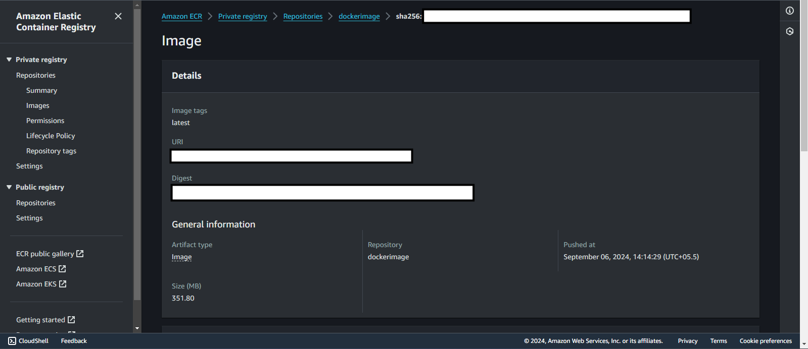

# COM04-AWS100 - Push a Docker image to Amazon ECR repository

## Cloud Service Provider

- Amazon Web Services

## Difficulty

- Level 100 (Introductory)

## Project's Author(s)

- [Johan Rin](https://twitter.com/johanrin)

## Objectives

### Prerequisites

- A Docker image

### You need to complete the following:

- Create your Amazon ECR repository
- Authenticate your Docker to Amazon ECR
- Tag your Docker image with the Amazon ECR repository
- Push your image to Amazon ECR

### You need to answer the following:

### ***What is the URL for your default registry?***

The URL for my default Amazon Elastic Container Registry (ECR) is: `851725387103.dkr.ecr.us-east-1.amazonaws.com/dockerimage:latest`

### ***What is a _Tag immutability_ in Amazon ECR repository?***

Tag immutability in Amazon ECR means that once an image tag is pushed to the repository, the tag cannot be overwritten or updated. This ensures that any specific image version is preserved, which can help with traceability, security, and preventing accidental overwrites. Enabling tag immutability is beneficial for enforcing the integrity of your container images and ensuring reproducible deployments.

### ***What is a _Scan on push_ in Amazon ECR repository?***

Scan on push is an option in Amazon ECR that automatically scans container images for vulnerabilities when they are pushed to the repository. This feature integrates with Amazon Inspector to detect potential security issues in the software packages within your container images. You can configure this setting to ensure that every image pushed to ECR is checked for known vulnerabilities before deployment.

### ***How many registry authentication methods are available?***

There are three main authentication methods for Amazon ECR:
- Amazon ECR authentication token: A temporary token that you can retrieve using the AWS CLI, SDK, or API, used to authenticate with the registry. This token is valid for 12 hours.
- AWS Identity and Access Management (IAM) roles and policies: You can use IAM roles to authenticate and authorize access to the ECR registry based on specific IAM policies.
- ECS Task Roles and EKS IAM Roles for Service Accounts: For ECS and EKS, roles are used to give containerized applications access to the registry.

### ***How long an _Authorization Token_ is valid?***

An Amazon ECR authorization token is valid for 12 hours. After this time, you will need to retrieve a new token to authenticate with the registry. But you can configure the expiration time using the `--expires-in` parameter when creating the token.

### ***How many tags per image can you apply in Amazon ECR?***

You can apply up to 100 tags to a single image in Amazon ECR. These tags help in versioning and organizing images within the registry.

## References

- [Get started with Docker](https://docs.docker.com/get-started/)
- [How to build a Docker image](https://www.youtube.com/watch?v=6Er8MAvTWlI)
- [Creating a Repository](https://docs.aws.amazon.com/AmazonECR/latest/userguide/repository-create.html)
- [Registry Authentication](https://docs.aws.amazon.com/AmazonECR/latest/userguide/Registries.html#registry_auth)
- [Pushing an image](https://docs.aws.amazon.com/AmazonECR/latest/userguide/docker-push-ecr-image.html)

## Costs

- Included in the Free Tier

## Estimated time to complete

- 30 minutes - only if you already have a Docker image

# Output

