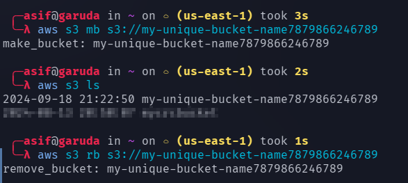

# DEV03-AWS100 —  Install & Configure AWS CLI then create an S3 Bucket

## Cloud Service Provider
* Amazon Web Services (AWS)

## Difficulty
Level 100 (Introductory)

## Estimated Time
* 30 - 40 minutes
  
## Project's Author(s)
* [Ariela](https://twitter.com/ari_hacks)

## Objectives

###  You need to complete the following:

* Create an IAM user with a programmatic access type (and Administrator Access) if you do not have one already
* Install AWS CLI 
* Configure AWS credentials locally: `aws configure` 
* Create an S3 bucket: `aws s3 mb s3://<unique-bucket-name>`
* Check the bucket was created: `aws s3 ls`
* Delete the bucket when you are done: `aws s3 rb s3://<unique-bucket-name>`

###  You need to answer the following: 

### ***How are permissions granted to IAM users?***

Permissions are granted to AWS Identity and Access Management (IAM) users through **IAM policies**. These policies define what actions a user can or cannot perform on AWS resources. Permissions are attached to users in the following ways:

- **Directly attached policies:** You can attach a managed policy directly to an IAM user.
- **Group policies:** Users inherit permissions from IAM policies attached to any groups they are part of.
- **Inline policies:** Policies can be embedded directly into a user, group, or role, giving them specific permissions.

Policies are written in JSON format and define permissions using **action**, **resource**, and **effect** (allow/deny). AWS evaluates these policies to decide whether to allow or deny actions on resources.

### ***What credentials are created when configuring AWS locally and where are they stored?***

When you configure AWS CLI or SDK on a local machine using `aws configure`, the following credentials are created:

- **Access Key ID:** A unique key used to identify the IAM user or role.
- **Secret Access Key:** A secret key used to sign requests to AWS services.
- **Optional Session Token:** Used if temporary credentials are being used (e.g., when assuming a role).

These credentials are stored in the following files on your local machine:

- **Credentials file:** Located at `~/.aws/credentials` (Linux/macOS) or `C:\Users\<Username>\.aws\credentials` (Windows).
- **Config file:** Located at `~/.aws/config` (Linux/macOS) or `C:\Users\<Username>\.aws\config` (Windows).

These files store the credentials and configuration profiles for accessing AWS services.

### ***What is the difference between `s3` and `s3api` Commands?***

The AWS CLI provides two different command sets for interacting with Amazon S3: `s3` commands and `s3api` commands. The key differences are:

- **`s3` commands:**
     - High-level commands designed for **simplified** operations.
     - Operations include `cp`, `mv`, `sync`, `ls`, `rm`, etc., which are similar to Unix shell commands.
     - Focuses on common, batch, or recursive file operations on S3 objects.
     - Best used for tasks like transferring files, synchronizing local directories with S3, and listing objects.

Example:
```bash
aws s3 cp file.txt s3://mybucket/file.txt
```

 
- **`s3api` commands:**

     - Low-level commands designed for **fine-grained control** over S3.
     - Provides direct access to the **S3 API** operations like `create-bucket`, `put-object`, `get-object`, and others.
     - Offers full control over S3 features such as enabling versioning, bucket policies, configuring lifecycle rules, etc.
     - Best used when detailed configurations and S3 features are needed.

Example:
```bash
aws s3api create-bucket --bucket mybucket --region us-west-2
```

## References

* [Create an IAM user](https://docs.aws.amazon.com/IAM/latest/UserGuide/id_users_create.html)
* [Install AWS CLI on MacOS](https://docs.aws.amazon.com/cli/latest/userguide/install-macos.html) or with Homebrew:  `brew install awscli` `aws --version`
* [Install AWS CLI on Windows](https://docs.aws.amazon.com/cli/latest/userguide/install-cliv2-windows.html)
* [Install AWS CLI on Linux](https://docs.aws.amazon.com/cli/latest/userguide/install-cliv2-linux.html)
* [Configure AWS locally](https://docs.aws.amazon.com/cli/latest/userguide/cli-configure-quickstart.html)
* [Leveraging the s3 and s3api Commands](https://aws.amazon.com/blogs/developer/leveraging-the-s3-and-s3api-commands/)


## Tips
  - IAM users with programmatic access are given an *access key id* and *secret access key*. After creating a user a *Download.csv* file is generated that contains these values. Download and save the file to access them for setting up AWS locally.

# Output

