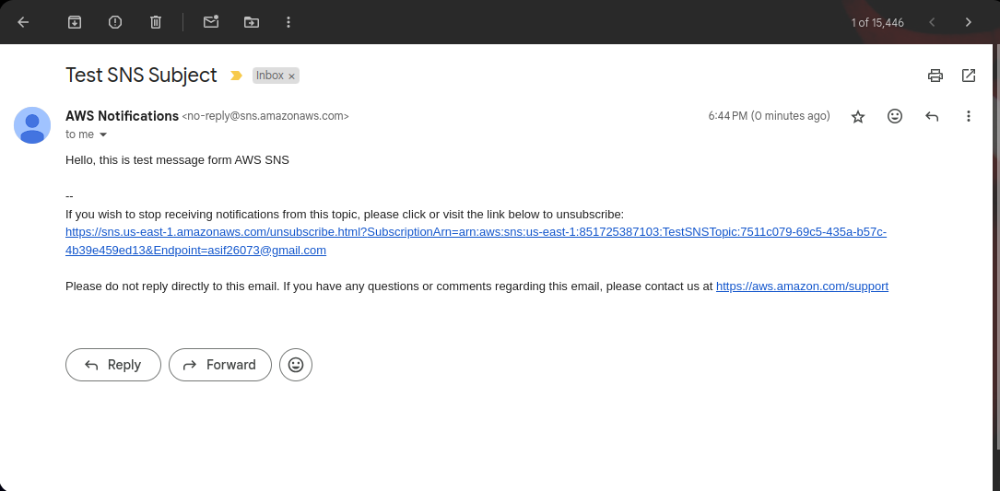

# GLU02-AWS100 - Introduction to SNS (Simple Notification Service)

## Cloud Service Provider
- Amazon Web Services

## Difficulty
- Level 100 (Introductory)

## Project's Author(s)

- [Edward Allen Mercado](https://twitter.com/edwardmercado_)

## Objectives

### You need to complete the following:

- Create an SNS topic
- Subscribe to that SNS topic with an email address of yours
- Make sure to accept the subscription in the email you receive
- Send a test message through the SNS topic
- Make sure you received the message to your email address

### You need to answer the following:

### ***What is Simple Notification Service (SNS)?***

**Amazon Simple Notification Service (SNS)** is a fully managed messaging service provided by AWS that enables you to send messages to multiple subscribers through a "publish/subscribe" model. SNS decouples the messaging from your infrastructure, allowing you to send notifications to a large number of distributed systems, users, or other applications. It can push notifications to various endpoints such as mobile devices (via SMS or push notifications), email, HTTP/HTTPS endpoints, or AWS services like SQS or Lambda.

### ***How do Pub/Sub notifications work?***

The **Pub/Sub** (Publish/Subscribe) model in SNS operates as follows:

1. **Topic Creation:** A topic is created by the publisher (the service or user who wants to send messages).
2. **Subscription:** Subscribers (other AWS services, applications, or endpoints) subscribe to the topic to receive notifications.
3. **Publishing:** The publisher sends a message to the topic.
4. **Message Delivery:** SNS automatically sends the message to all subscribers of the topic through their respective endpoints. Delivery is fan-out, meaning the same message is pushed to all subscribers.

In this model, the publisher doesn't need to know about the details of the subscribers, and the subscribers don’t need to interact directly with the publisher.

### ***What are the different endpoints that SNS can send notifications to?***

SNS can send notifications to a variety of endpoints, including:

1. **Amazon SQS:** Sends notifications to Amazon Simple Queue Service queues.
2. **AWS Lambda:** Triggers AWS Lambda functions in response to messages.
3. **HTTP/HTTPS:** Delivers messages to web endpoints over HTTP or HTTPS.
4. **Email/Email-JSON:** Sends notifications via email, either in text format or JSON format.
5. **SMS:** Sends text messages to mobile devices via SMS.
6. **Mobile Push Notifications:** Sends push notifications to mobile devices (iOS, Android, Windows, etc.) through services like Apple Push Notification Service (APNS) and Firebase Cloud Messaging (FCM).

### ***What happens if a message or notification in SNS cannot be delivered?***

If a message or notification cannot be delivered, SNS handles it based on the type of endpoint:

- For **SQS, Lambda, or HTTP/HTTPS** endpoints, SNS will attempt to deliver the message a few times (depending on the retry policy) before marking it as failed.
- For **SMS**, if delivery fails, no further retries are made, but you can track delivery status via CloudWatch logs.
- **Dead-letter queues (DLQ)** can be configured for SQS and Lambda endpoints to capture messages that fail after multiple delivery attempts.
- SNS also supports **delivery status logging** using Amazon CloudWatch for debugging and monitoring failures.

### ***What's the difference between Simple Notification Service (SNS) and Simple Queue Service (SQS)?***

- **SNS** uses a push-based model, where messages are delivered immediately to subscribers (e.g., HTTP endpoints, Lambda functions, etc.) as soon as they are published to a topic.
- **SQS** uses a pull-based model, where messages are stored in queues, and consumers must poll (pull) the queue to receive them.

**Key differences:**

1. **Delivery Model:**
    - **SNS:** Push-based (messages are pushed to subscribers).
    - **SQS:** Pull-based (messages are stored in queues and must be pulled by consumers).
2. **Use Case:**

    - **SNS:** Suitable for real-time notifications where the message needs to be delivered to multiple subscribers (fan-out messaging).
    - **SQS:** Best for decoupling services or processing tasks asynchronously, where messages are processed by one or more workers.

3. **Message Retention:**

    - **SNS:** Does not store messages after they are delivered.
    - **SQS:** Messages can be stored for up to 14 days in a queue.

4. **Subscriber Count:**

    - **SNS:** Supports multiple subscribers (many-to-many relationship).
    - **SQS:** Supports one-to-one communication between sender and receiver. However, SQS can be combined with SNS to achieve fan-out.

By combining SNS and SQS, we can achieve powerful architectures, where SNS pushes messages to SQS queues, and those queues are polled by consumers for processing.

## Reference

- [AWS SNS Official Documentation](https://docs.aws.amazon.com/sns/latest/dg/welcome.html)
- [Setting Up Amazon SNS Notifications](https://docs.aws.amazon.com/AmazonCloudWatch/latest/monitoring/US_SetupSNS.html)
- [Amazon SNS (from AWS) - The Ultimate Guide](https://www.serverless.com/amazon-sns)
- [What is Amazon SES and SNS in AWS?](https://intellipaat.com/blog/what-is-amazon-ses-sns-in-aws/)

## Costs

- Included in the Free Tier

## Estimated time to complete

- 10 minutes

## Output

