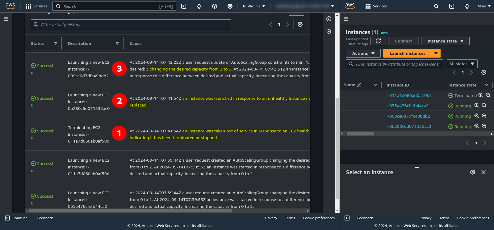

# COM03-AWS200 - Create an Auto Scaling Group

## Cloud Service Provider
- Amazon Web Services

## Difficulty
- Level 200 (Intermediate)

## Project's Author(s)

[Chris Nagy](https://twitter.com/chris_the_nagy)

## Objectives

### You need to complete the following:
- Create a Launch Configuration
- Create an Auto Scaling Group with a minimum of two and maximum of five EC2 instances
- Terminate one instance manually
- After the ASG is in place, increase the desired number of instances to three
- Delete all the resources you created

### You need to answer the following:
### ***What are the key differences between a Launch Template and Launch Configuration?***

- **Launch Templates:**
  - More flexible and modern than Launch Configurations.
  - Can be **versioned**, allowing multiple versions of the same template to be created and used.
  - Supports a wide range of EC2 features, like **T2/T3 unlimited, elastic GPUs, placement groups**, and **enclave support**.
  - You can define **multiple instance types** in a Launch Template, which is useful for diversified instance use, including Spot and On-Demand.
  - Can be used with **mixed instance policies** (e.g., combine Spot and On-Demand instances).

- **Launch Configurations:**
  - Simpler and older.
  - Does not **support versioning**.
  - Lacks support for many newer EC2 features and configurations.
  - Only supports **one instance type** per configuration.
  - Must create a new Launch Configuration for every update, which can be less efficient.

### ***What happens if you terminate one of the running instances in an ASG manually?***

When you manually terminate an instance in an Auto Scaling Group (ASG):

- **Auto Scaling will detect** the instance termination.
- It will automatically **launch a new instance** to maintain the desired capacity.
- If you want to avoid replacing the instance, you can temporarily suspend the scaling processes in the ASG.

### ***How can you set and change the minimum, desired and maximum number of instances in an ASG?***

In the Auto Scaling Group settings, you can adjust the values for Minimum, Desired, and Maximum instances.

### ***Based on what metrics can an ASG spin up / spin down instances?***

Auto Scaling Groups can scale in or out based on the following types of metrics:

- **Default CloudWatch Metrics**:
  - **CPU utilization**
  - **Network traffic (in/out)**, e.g., scaling based on data transfer rates.
  - **Memory usage** (via custom CloudWatch metrics, since memory metrics aren’t provided by default).

- **Custom CloudWatch Metrics:**
  - You can configure ASG to respond to **any custom metrics** sent to CloudWatch (e.g., application latency, request count, database queue length).

- **Scaling Policies:**
  - **Target tracking scaling:** Maintain a target for a specific metric, e.g., keep average CPU utilization at 50%.
  - **Step scaling:** Scale based on predefined step adjustments when thresholds are crossed.
**Scheduled scaling:** Scale at specific times, for example, when traffic is expected to increase or decrease.

### ***What EC2 configuration settings can you set in a Launch Template/Configuration?***

- **Instance Type** (e.g., t3.medium)
- **AMI (Amazon Machine Image) ID**
- **Key Pair** for SSH access.
- **Security Groups** for networking and firewall rules.
- **IAM Role** for the instance.
- **User Data** scripts to execute on instance launch.
- **Block Device Mappings** (EBS volume configuration).
- **Instance Purchasing Option** (e.g., On-Demand or Spot Instances).
- **Network Interface Settings** (e.g., private IP addresses).
- **Placement Group** or **Affinity** settings.
- **Monitoring and Detailed Monitoring** (CloudWatch).
- **Tenancy** (dedicated or shared hardware).
- **Shutdown behavior** and **termination protection**.

### ***Can you use Spot instances with a Launch Template/Configuration?***

Yes, you can use **Spot Instances** with both **Launch Templates** and **Launch Configurations**:

- **Launch Templates** provide better flexibility for using Spot Instances, as you can define **multiple instance types** and **mix Spot and On-Demand instances** within the same ASG.
- With **Launch Configurations**, you can specify Spot Instances but cannot mix instance types or instance purchase options as efficiently as with Launch Templates.

### ***How many subnets and regions can a single ASG utilize?***

- **Subnets:** A single Auto Scaling Group can be associated with **multiple subnets** in the same **VPC**. These subnets can span across **multiple Availability Zones** within a region.
- **Regions:** An ASG is bound to a **single region**. You cannot span an ASG across multiple regions. However, you can create **separate ASGs in different regions** if needed.

### ***What is the difference between "desired capacity" and "minimum capacity"?***

- **Desired Capacity**: The number of instances that the ASG tries to maintain. It can be between the **minimum** and **maximum** capacity. If the ASG launches or terminates instances, it will aim to return to the desired capacity.

- **Minimum Capacity**: The **minimum number of instances** that must always be running in the ASG. If the number of running instances falls below this value, Auto Scaling will launch new instances to meet this requirement.

### ***In which order will EC2 instances be terminated in case of a scale-in event?***
When an ASG needs to scale in (terminate instances), the termination order is determined by the **termination policies** configured in the ASG. AWS follows this process:

1. **Default Termination Policy** (if no custom policy is set):

    - It tries to **balance across Availability Zones** to ensure equal distribution.
    - The instance with the **oldest launch configuration/template** is terminated first.
    - If multiple instances have the same age, it picks the one with the oldest launch time.
    - Spot Instances might be terminated first (depending on price changes).

2. **Custom Termination Policies:** You can customize the order of termination based on criteria like:

    - **Instance age**.
    - **Instance type**.
    - **Instance health status** (terminate unhealthy instances first).

## References
- [What Is Amazon EC2 Auto Scaling?](https://docs.aws.amazon.com/autoscaling/ec2/userguide/what-is-amazon-ec2-auto-scaling.html)
- [Auto Scaling Groups](https://docs.aws.amazon.com/autoscaling/ec2/userguide/AutoScalingGroup.html)
- [AWS Auto Scaling FAQs](https://aws.amazon.com/autoscaling/faqs/)

## Costs
- Included in the Free Tier

## Estimated time to complete
- 10 minutes

## Tips
- Use t2.micro instances for the Auto Scaling Group to avoid unexpected charges.
- Don't panic if the instances always come back after you delete them, there's a reason for that.

## Output

