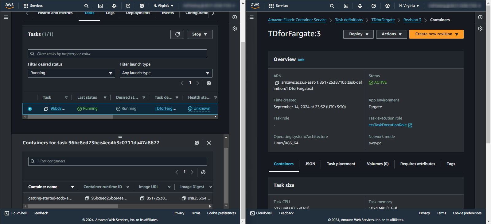

# COM04-AWS200 - Deploy a Docker container image on AWS Fargate

## Cloud Service Provider

- Amazon Web Services

## Difficulty

- Level 200 (Intermediate)

## Project's Author(s)

- [Johan Rin](https://twitter.com/johanrin)

## Objectives

### Prerequisites

- [Push a Docker image to Amazon ECR repository](./COM04-AWS100.md)

### You need to complete the following:

- Configure your container with your Docker image
- Configure your task definition
- Define your service
- Configure your cluster

### You need to answer the following:

### ***What is a container?***

A container is a lightweight, standalone, and executable software package that includes everything needed to run a piece of software, including the code, runtime, libraries, and dependencies. Containers provide a consistent environment for applications to run across various computing environments, making them ideal for microservices and cloud-native applications.

### ***What is the difference between Soft memory limit and Hard memory limit for a custom container?***

- **Soft Memory Limit:** This is a limit that the container can use but is not strictly enforced. If the container exceeds this limit, it might still run, but it will be flagged for potential issues. This allows for some flexibility in memory usage.
- **Hard Memory Limit:** This is a strict limit enforced by the container runtime. If the container exceeds this memory limit, it will be terminated or throttled to prevent excessive resource usage. It ensures that the container does not exceed a certain memory usage threshold.

### ***What is a task definition?***

A task definition is a blueprint for your application in Amazon ECS (Elastic Container Service). It describes one or more containers that form your application and specifies their configurations, such as CPU and memory requirements, Docker image, and port mappings. The task definition is used to launch tasks and services within ECS.

### ***What is the name of the default task execution role?***

The default task execution role in Amazon ECS is ```ecsTaskExecutionRole```. This IAM role allows ECS to pull container images from Amazon ECR (Elastic Container Registry), manage logs in Amazon CloudWatch, and interact with other AWS services on behalf of your tasks.

### ***What does a task size allow?***

The task size refers to the amount of CPU and memory resources allocated to a task in Amazon ECS. It determines how much processing power and memory are available for the containers within the task. This allocation affects the performance and scalability of your application.

### ***What is a service?***

In Amazon ECS, a service is a long-running task or set of tasks that ensure the desired number of task instances are running and properly distributed. Services manage tasks to maintain the specified count and can integrate with load balancers to distribute incoming traffic.

### ***Which load balancer type Fargate can handle?***

Amazon ECS with AWS Fargate can handle both **Application Load Balancers (ALBs)** and **Network Load Balancers (NLBs)**. ALBs operate at the application layer (Layer 7), providing advanced routing and SSL termination, while NLBs operate at the transport layer (Layer 4), handling high-throughput and low-latency connections.

### ***How many security groups are created by default if you use a load balancer?***

By default, when you create an Application Load Balancer or Network Load Balancer, it creates **one security group** for the load balancer. You can configure this security group to control the inbound and outbound traffic to and from the load balancer.

### ***What is a cluster?***

A cluster in Amazon ECS is a logical grouping of tasks and services. It allows you to manage resources, such as EC2 instances or Fargate tasks, and coordinate their operation. Clusters can be used to organize and isolate different environments or applications.

### ***What are cluster names limitations?***

Cluster names in Amazon ECS have the following limitations:
- Must be between 1 and 255 characters long.
- Can include letters, numbers, hyphens, and underscores.
- Must be unique within your AWS account in the same region.


## References

- [Getting started with Amazon ECS using Fargate](https://docs.aws.amazon.com/AmazonECS/latest/developerguide/getting-started-fargate.html)
- [Deploy Docker Containers](https://aws.amazon.com/getting-started/hands-on/deploy-docker-containers/)
- [How Amazon ECS manages CPU and memory resources](https://aws.amazon.com/blogs/containers/how-amazon-ecs-manages-cpu-and-memory-resources/)
- [Amazon ECS Task Execution IAM Role](https://docs.aws.amazon.com/AmazonECS/latest/developerguide/task_execution_IAM_role.html)

## Costs

- Included in the Free Tier

## Estimated time to complete

- 10 minutes

## Output

