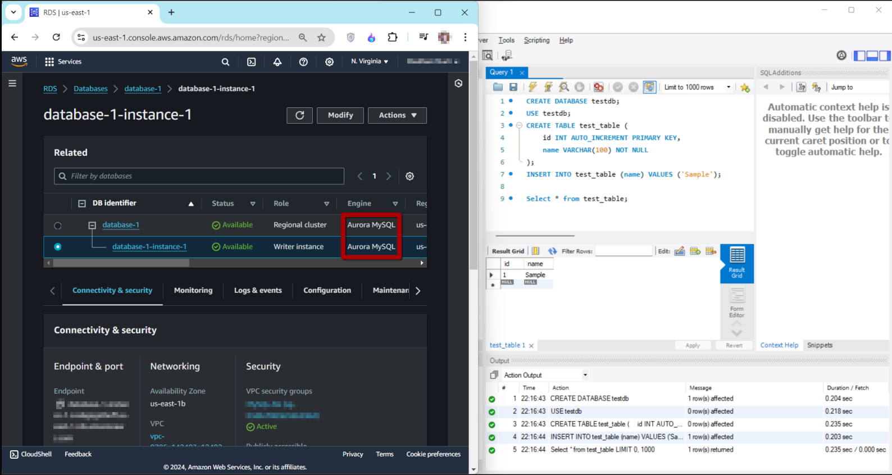

# DBS03-AWS200 - Create an Aurora RDS Database

## Cloud Service Provider
- Amazon Web Services

## Difficulty
- Level 200 (Intermediate)

## Project's Author(s)
- [Nathan Cho](https://twitter.com/hatchcanon)

## Objectives

### You need to complete the following:
- Create a Security Group in your default VPC that allows traffic from `0.0.0.0/0` (public internet) on port `3306`
- Use the "standard create" mode and choose "MySQL compatibility" with "regional" and "Dev/Test" mode
- Specify your own password for the database
- Choose the db.r5.large instance size
- Choose the region's default VPC
- Enable "Public Access" and add the above created Security Group
- Create the database
- Connect from your computer to the newly created database with a MySQL DBMS like [MySQL Workbench](https://dev.mysql.com/downloads/workbench/?os=src) or [Sequel Ace](https://github.com/Sequel-Ace/Sequel-Ace)
- Create a test table in your database to verify everything is working correctly
- Delete the database

### You need to answer the following:
### ***What type of database is Aurora?***

**Amazon Aurora** is a relational database service that is compatible with both **MySQL** and **PostgreSQL**. It's a managed database service developed by Amazon Web Services (AWS) that offers high performance, availability, and scalability.

### ***What is the minimum storage for Aurora?***

The minimum storage requirement for an Amazon Aurora database is 10 GB. Aurora automatically scales storage in **10 GB** increments, up to a maximum of **128 TB**

### ***What is Aurora Serverless and how does it differ from regular RDS DB instances?***

**Aurora Serverless** is an on-demand, auto-scaling configuration for Aurora that automatically adjusts the database capacity based on application needs. Unlike regular RDS instances, which require you to specify and manage the instance size, Aurora Serverless scales compute capacity up or down seamlessly, allowing for variable workloads and potentially lower costs if you have unpredictable or infrequent usage patterns.

### ***How does Aurora's data distribution (redundancy) work, and what are the options for more redundancy?***

Aurora distributes data across multiple Availability Zones (AZs) within a region. It uses a distributed, fault-tolerant storage system where data is replicated across multiple AZs. For additional redundancy, you can enable **Aurora Replicas** and use **Aurora Global** Databases. Aurora Replicas can be used to offload read traffic, while Aurora Global Databases provide cross-region replication for disaster recovery and low-latency global reads.

### ***How do Aurora's read & write replicas work?***

**Write Replicas** handle all write operations and are used for managing write workloads. **Read Replicas** are used to offload read traffic and improve performance. In Aurora, the concept of read replicas is implemented as **Aurora Replicas**, which are in the same region as the primary instance and can be used to scale read traffic. Aurora automatically manages replication to these replicas.

### ***What is the difference between a "reader" and a "writer" endpoint/instance?***

The **writer endpoint** is used for all write operations and connects to the primary instance of the Aurora cluster. The **reader endpoint** is used for read operations and distributes read queries across available Aurora Replicas. This helps balance the load and optimize performance for read-heavy applications.

### ***What are the four types of Aurora Endpoints?***

The four types of Aurora endpoints are:
- **Cluster Endpoint:** The primary endpoint for write operations. It connects to the primary instance.
- **Reader Endpoint:** Distributes read traffic across the Aurora Replicas within the cluster.
- **Instance Endpoint:** Provides a direct connection to a specific instance (primary or replica) for specialized use cases.
- **Custom Endpoints:** Allows you to define your own endpoint that points to a specific subset of instances, useful for targeting specific instances for certain types of workloads.

### ***Does Aurora offer database encrpytion?***

Yes, Aurora supports **database encryption**. You can enable encryption at rest using AWS Key Management Service (KMS) to encrypt your database volumes and snapshots. Data in transit can also be encrypted using SSL/TLS.

### ***Why is it a bad idea to enable "Public Access"? Why did we enable public access this time?***

Enabling **public access** allows your database to be accessible from the internet, which can expose it to potential security risks and attacks. It's generally advisable to restrict access to trusted networks and use private connectivity. Public access is typically enabled temporarily for development, debugging, or testing purposes. However, if it's necessary to enable it, ensure you implement proper security measures such as using strong passwords, restricting IP addresses, and monitoring access logs.

## References
- [AWS Create a DB Instance](https://docs.aws.amazon.com/AmazonRDS/latest/UserGuide/CHAP_Tutorials.WebServerDB.CreateDBInstance.html)
- [RDS FAQs](https://aws.amazon.com/rds/faqs/)
- [An Introduction to Amazon Aurora](https://dzone.com/articles/an-introduction-of-amazon-aurora)

## Costs
- Amazon Aurora is not included in the free tier
- An Aurora database running on the (cheapest) db.r5.large instance [will cost $0.29 per hour](https://aws.amazon.com/rds/aurora/pricing/)

## Estimated time to complete
- 20 minutes

## Tips
- To delete the database, make sure that you have disabled "deletion protection"

## Output

