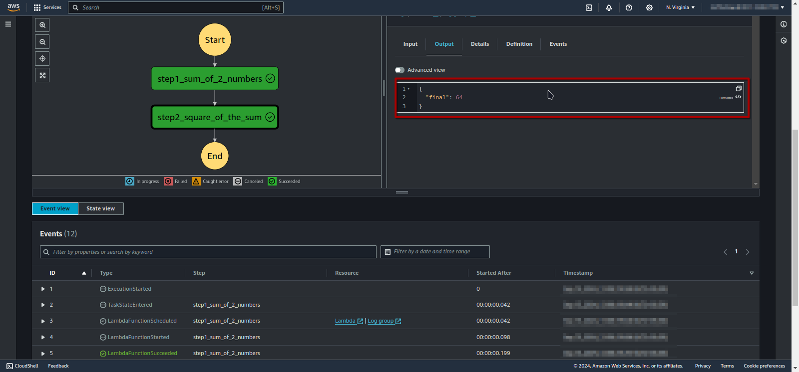

# GLU07-AWS200 - Setup a Simple State Machine with at Least Two Steps
## Cloud Service Provider
- Amazon Web Services

## Difficulty
- Level 200 (Intermediate)

## Project's Author(s)

- [Syed Auther](https://twitter.com/syedauther)

## Objectives

### You need to complete the following:
* Create an AWS Lambda to add 2 numbers supplied as input
* Create an AWS Lambda to return the square of a number
* Create a state machine to connect the above two Lambdas
	* Do not change the default settings.
* Execute the state machine and verify the output.

### You need to answer the following:
### ***What is a step function?*** 

AWS Step Functions is a serverless orchestration service that lets you coordinate multiple AWS services into serverless workflows. It enables you to design and manage workflows that can perform complex tasks, integrate various services, and handle errors, retries, and parallel processing. With Step Functions, you define workflows as a series of steps, making it easier to build and maintain distributed applications and services.

### ***What is a state machine?***

A state machine in the context of AWS Step Functions is a series of steps that define a workflow. Each step represents a state, and the transitions between these states define how the workflow progresses. State machines help manage the execution flow of a process, specifying what actions to perform and how to handle different conditions, errors, or branching paths. They are defined using the Amazon States Language (ASL).

### ***What is workflow configuration and  state management?***

- **Workflow Configuration:** This involves setting up the steps and transitions of a state machine. It includes defining states (e.g., Task, Choice, Parallel), specifying their behaviors, and configuring how they interact with each other.
- **State Management:** This refers to how the state machine maintains the status of each step and manages transitions between states. It includes handling input and output data for each step, managing errors and retries, and maintaining the overall execution context.

### ***What is [Amazon States Language](https://docs.aws.amazon.com/step-functions/latest/dg/concepts-amazon-states-language.html)?***

Amazon States Language (ASL) is a JSON-based language used to define state machines in AWS Step Functions. ASL allows you to specify the workflow's states, transitions, and error handling in a structured format. It includes constructs for defining different types of states (e.g., Task, Choice, Fail, Succeed) and how they interact with each other.

### ***What are tasks?***

AWS Step Functions, a Task is a type of state that performs work in a state machine. Tasks represent a single unit of work, such as invoking a Lambda function, making an API call, or executing a batch job. The Task state is where the actual processing occurs, and it typically interacts with other AWS services to carry out its function.

### ***How to visualize the state machine?***

You can visualize a state machine using the AWS Management Console. AWS Step Functions provides a visual workflow editor that allows you to see and manage the flow of your state machine graphically. This visualization helps you understand the state transitions, data flow, and overall structure of your workflow. You can also use the console to debug and monitor the execution of your state machines.

## References
- [AWS Step Functions- Getting Started](https://aws.amazon.com/step-functions/)
- [FAQs](https://aws.amazon.com/step-functions/faqs/)
- [Features of Step functions](https://aws.amazon.com/step-functions/features/)
- [Tasks in step functions](https://docs.aws.amazon.com/step-functions/latest/dg/amazon-states-language-task-state.html)
- [Wait state in step functions](https://docs.aws.amazon.com/step-functions/latest/dg/amazon-states-language-wait-state.html)
- [I/O data  processing ](https://docs.aws.amazon.com/step-functions/latest/dg/concepts-input-output-filtering.html)

## Estimated Time
- 15 minutes 

## Estimated Cost
- This project is included in the free tier. 

## Ideas
- Just create a Lambda function with default settings and choose the language you want to code in, if you do not want the exact same implementation as this excercise. Make your own flow, take a look at some [use cases](https://aws.amazon.com/step-functions/use-cases/)

## Output

