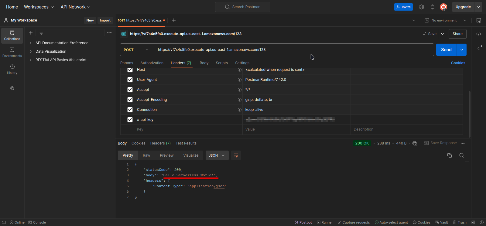

# LES01-AWS200 - Create a Serverless API 
## Cloud Service Provider
- Amazon Web Services

## Difficulty
- Level 200 (Intermediate)

## Project's Author(s)

[Syed Auther](https://twitter.com/syedauther)

## Objectives

### You need to complete the following:
- Create an AWS Lambda with a language of your choice, the purpose of this Lambda is to respond with a 'Hello Serverless World!' message.
- Create an API Gateway endpoint and connect it to the AWS Lambda function created above and deploy it as an API that can be consumed from POSTMAN.
- Secure the API with an API Key

### You need to answer the following:
### ***What is Function as a service?***

**Function as a Service (FaaS)** is a serverless computing model where you write and deploy individual functions (or pieces of code) that are executed in response to events. With FaaS, you don’t need to manage the underlying server infrastructure; instead, you only focus on writing the code that performs a specific task. AWS Lambda is a popular example of a FaaS offering.

### ***How many languages are supported by AWS Lambda***

AWS Lambda supports several programming languages. As of now, Lambda natively supports languages like:
- Node.js
- Python
- Ruby
- Java
- Go
- .NET Core (C#)
- Custom runtimes via AWS Lambda Extensions API (allowing you to use other languages like PHP, Perl, etc.)

### ***What is the maximum memory allocated to an AWS Lambda function?***

AWS Lambda allows you to allocate a maximum of 10,240 MB (10 GB) of memory to a function.

### ***How many ways to deploy a Lambda function?***

There are several ways to deploy a Lambda function:
- **AWS Management Console:** Deploy directly from the web interface.
- **AWS CLI (Command Line Interface):** Use commands to deploy functions.
- **AWS SDKs:** Deploy programmatically using SDKs in various languages.
- **Infrastructure as Code (IaC) tools:** Such as AWS CloudFormation, AWS CDK (Cloud Development Kit), or Terraform.
- **CI/CD Pipelines:** Automate deployments using tools like AWS CodePipeline or third-party CI/CD tools.

### ***Mention some triggers for AWS Lambda apart from API Gateway***

AWS Lambda can be triggered by various AWS services, including:
- Amazon S3 (e.g., file uploads)
- Amazon DynamoDB (e.g., table updates)
- Amazon SQS (Simple Queue Service)
- Amazon SNS (Simple Notification Service)
- Amazon CloudWatch Events (for scheduled tasks and event-driven workflows)
- Amazon Kinesis (for streaming data)
- AWS Step Functions (for orchestration)
- AWS IoT Core (for IoT device events)

### ***How to assign a role to AWS Lambda?***

You assign an IAM (Identity and Access Management) role to an AWS Lambda function by specifying the role during function creation or updating:

- **In the AWS Management Console:** When creating or updating a function, you can select an existing role or create a new role with the appropriate permissions.
- **Using AWS CLI:** You can use the ```--role``` parameter with the ```create-function``` or ```update-function-configuration``` commands to specify the IAM role ARN.
- **Via AWS SDKs:** When using the SDKs, you can specify the role in the function configuration code.

### ***How many way to secure an API Gateway endpoint?***

You can secure an API Gateway endpoint in various ways:
- **IAM Roles and Policies:** Control access using IAM policies.
- **API Keys:** Require clients to provide a key.
- **Lambda Authorizers (formerly Custom Authorizers):** Use Lambda functions to authorize requests.
- **Cognito User Pools:** Integrate with Amazon Cognito for user authentication.
- **Resource Policies:** Restrict access based on IP addresses or VPCs.
- **WAF (Web Application Firewall):** Use AWS WAF to protect against common web exploits.

### ***How to add API Gateway as a trigger for AWS Lambda?***

To add API Gateway as a trigger for AWS Lambda:
- **In the AWS Management Console:** Create or configure an API in API Gateway, then set up a new method (e.g., GET, POST) and choose “Lambda Function” as the integration type. Specify the Lambda function to invoke.
- **Using AWS CLI:** You can use the ```aws apigateway``` commands to create and configure an API Gateway, and link it to your Lambda function.
- **Via AWS SDKs:** Programmatically configure API Gateway and associate it with your Lambda function using the SDKs.
- **With AWS CloudFormation or AWS CDK:** Define the API Gateway and Lambda integration in your infrastructure code.

## References
- [AWS Lambda- Getting Started](https://aws.amazon.com/lambda/getting-started/)
- [API Gateway Getting Started](https://aws.amazon.com/api-gateway/getting-started/)
- [Connecting AWS Lambda and API Gateway](https://docs.aws.amazon.com/lambda/latest/dg/services-apigateway-tutorial.html)
- [Securing the API](https://docs.aws.amazon.com/apigateway/latest/developerguide/apigateway-control-access-to-api.html)

## Ideas
- Use a browser to see if the output message 'Hello Serverless World!' is sent back as a response from your Lambda before securing your API. 
- You will need [POSTMAN](https://learning.postman.com/docs/getting-started/introduction/), for testing the API once its secured with an API Key. 
- POSTMAN is not a hard limit, but if you are familiar with any other testing utility you can use that too, but POSTMAN is a good to learn tool, that will come in handy for some other Serverless projects and APIs as well. 

## Costs
- Included in the Free Tier

## Estimated time to complete
- 20 minutes

## Tips
- Use the cloud9 IDE to code the hello world Lambda initially, and then explore other deployment ideas like zip file uploads and SAM deployments
- The AWS Lambda free usage tier includes **1M free requests per month and 400,000 GB-seconds of compute time per month**, so feel free to explore unhinged! 

## Output

