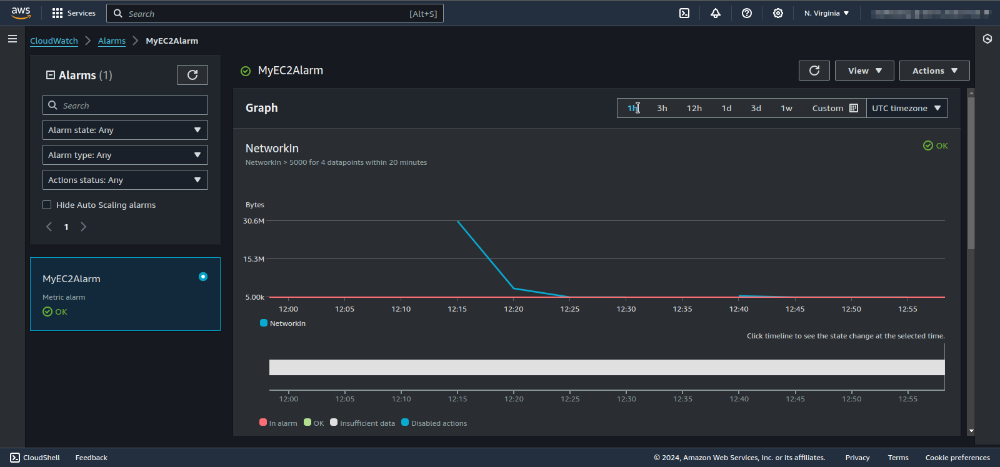

# OPS04-AWS200 - Create a CloudWatch Alarm

## Cloud Service Provider
- Amazon Web Services

## Difficulty
- Level 200 (Intermediate)

## Project's Author(s)
- [@andrewbrown](https://twitter.com/andrewbrown)

## Objectives

### You need to complete the following:
- Launch an EC2 t2.micro instance with a public IP address and supply the [provided bash script](OPS04-AWS200-userdata.sh) to install a simple website with an apache server in the UserData.
- Visit the the public IP so that you are generating NetworkIn. You need
  to do this so the Metric appears selectable when create your
CloudWatch Alarm
- Create a CloudWatch Alarm and use EC2 NetworkIn as the metric
- Set your CloudWatch Alarm to use a 5 minute period
- Set your CloudWatch Alarm to a very low static threshold such as 5000
- Set the Datapoint to alarms to 3 of 4
- Try to get the Alarm to trigger an Alert state by visiting the website
  and generating NetworkIN

### You need to answer the following:
### ***What is a CloudWatch Alarm?***

A CloudWatch Alarm is a feature in Amazon CloudWatch that monitors a specific metric and triggers actions based on defined criteria. For example, you can set up an alarm to notify you if your EC2 instance’s CPU utilization exceeds a certain percentage, or to trigger an auto-scaling policy if needed.

### ***What is a metric?***

A metric is a time-ordered set of data points that represent a specific aspect of your resources or application, such as CPU utilization, disk I/O, or network traffic. Metrics are used to monitor the performance and health of AWS resources.

### ***What do we mean when we say "breach"?***

When we say "breach" in the context of CloudWatch Alarms, we’re referring to the situation where a metric crosses a predefined threshold. For example, if you set an alarm to trigger when CPU utilization exceeds 80%, a breach occurs when the CPU utilization goes above that 80% threshold.

### ***What is a threshold?***

A threshold is the value that you set in a CloudWatch Alarm to define when the alarm should be triggered. For example, if you set a threshold of 75% for CPU utilization, the alarm will activate when the CPU usage goes above 75%.

### ***What is a data point?***

A data point is a single measurement of a metric at a specific time. For example, if you’re measuring CPU utilization every 5 minutes, each 5-minute measurement is a data point.

### ***What is a period?***

A period is the length of time over which a metric is aggregated into a single data point. For example, if you set a period of 300 seconds (5 minutes), CloudWatch will aggregate the metric data for 5 minutes into one data point.

### ***What are evaluation periods?***

Evaluation periods are the number of periods over which data is evaluated to determine whether an alarm should be triggered. For example, if you set an evaluation period of 3 periods with a period length of 5 minutes, CloudWatch will look at the metric data for the last 15 minutes (3 periods of 5 minutes each) to decide if the alarm condition is met.

## References
- [NetworkIN Instance Metric](https://docs.aws.amazon.com/AWSEC2/latest/UserGuide/viewing_metrics_with_cloudwatch.html#ec2-cloudwatch-metrics)
- [Using Amazon CloudWatch Alarms](https://docs.aws.amazon.com/AmazonCloudWatch/latest/monitoring/AlarmThatSendsEmail.html)

## Costs
- t2.micro is included in the Free Tier
- First 10 CloudWatch Alarms are included in the Free Tier

## Estimated time to complete
- 45 minutes

## Tips
- It takes EC2 5 minutes before it reports NetworkIN so expect to wait
  5-10 mins after visiting the website intially

## Output

