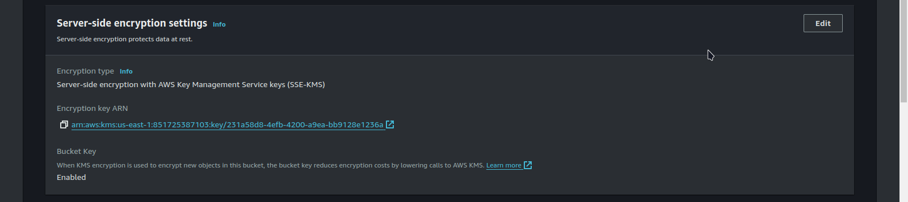

# SEC01-AWS200 — Create a new CMK in KMS and encrypt an object

## Cloud Service Provider
- Amazon Web Services

## Difficulty

- Level 200 (Intermediate)

## Project's Author(s)

- [Andrew Brown](https://twitter.com/andrewbrown)

## Objectives

### You need to complete the following:

- Create a new Customer Master Key (CMK) in Key Management Service (KMS)
- Create a new S3 bucket
- Upload an object (file) to the S3 Bucket
- Encrypt the uploaded file with your custom CMK

### You need to answer the following:

### ***What is a Hardware Security Module (HSM)?***

A **Hardware Security Module (HSM)** is a dedicated, tamper-resistant hardware device designed to securely generate, store, and manage cryptographic keys. HSMs provide a high level of security for encryption, decryption, and digital signing by physically isolating key materials. HSMs ensure that sensitive key material is stored securely, inaccessible from outside the module, and never leaves the device unencrypted. AWS offers AWS CloudHSM, a cloud-based HSM that helps customers meet compliance and regulatory requirements for key management and security.

### ***What is the difference between multi-tenant and single-tenant HSM?***

- **Multi-Tenant HSM:** In a **multi-tenant HSM**, multiple customers share the same physical hardware. While the HSM is logically partitioned, customers share the underlying infrastructure. Each customer’s keys and cryptographic operations are isolated within their own logical partition, ensuring that no customer can access another’s data. This option is typically more cost-effective but may have some performance variability due to shared resources.

- **Single-Tenant HSM:** In a **single-tenant HSM**, a single customer has exclusive access to the entire physical HSM device. This provides complete isolation and control over the HSM, making it ideal for organizations with stringent security or compliance requirements. AWS CloudHSM is an example of a single-tenant HSM service, providing customers with dedicated hardware in the cloud.

### ***What is the cost for for CloudHSM?***

The cost of using AWS CloudHSM depends on various factors, but the main pricing components are:

- **Hourly Charge per HSM:** AWS CloudHSM is priced at around $1.45 per hour for each active HSM instance.
- **Data Transfer Costs:** Standard AWS data transfer charges apply for data that is moved in and out of AWS services. There are no additional charges for operations within the HSM.

### ***What is key rotation?***

**Key rotation** refers to the practice of periodically changing cryptographic keys to reduce the risk of key compromise or cryptographic vulnerabilities over time. In AWS, key rotation helps enhance security by automatically generating new versions of the encryption keys used to secure data. For example, in **AWS Key Management Service (KMS)**, you can enable automatic key rotation, which rotates the key every 365 days. Key rotation ensures that data remains protected with up-to-date cryptographic keys without requiring manual intervention.

### ***How much do KMS keys cost?***
AWS Key Management Service (KMS) pricing consists of two main components:

**1. Key Storage:**
  - **$1 per month** for each KMS key (symmetric or asymmetric). This applies regardless of the number of times the key is used.

**2. Key Usage:**
  - **$0.03 per 10,000 requests** for cryptographic operations (such as encryption, decryption, signing, etc.).
  - For **asymmetric KMS keys** (e.g., RSA keys), usage costs may be slightly higher for operations like signing or verifying digital signatures.

Additionally, the first 20,000 requests each month are free, allowing for cost savings on low-volume key usage.

## Costs
- $1 per month

## Estimated time to complete
- 10 minutes

## Ideas
- Creating a single CMK key will result in $1 USD per month so ensure
  you delete your key at the end of this project.

## References
- [Key Management Service](https://aws.amazon.com/kms/)
- [CloudHSM](https://aws.amazon.com/cloudhsm/)
- [AWS Key Management Service concepts](https://docs.aws.amazon.com/kms/latest/developerguide/concepts.html)

## Output

