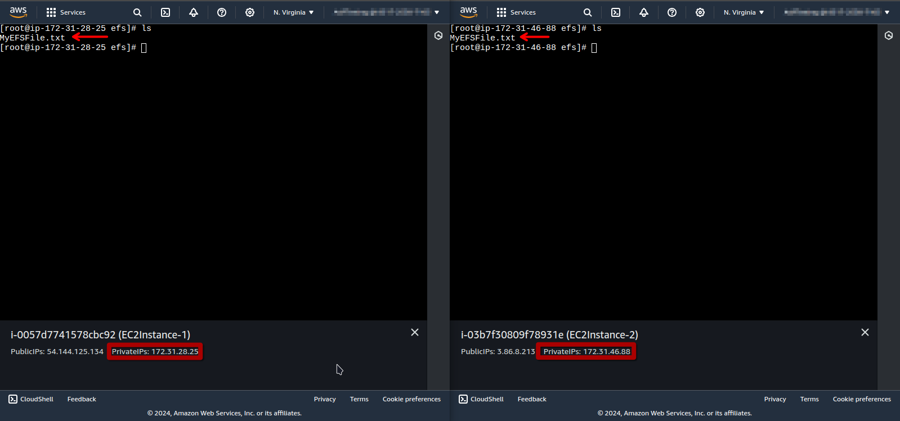

# STR03-AWS200 - Create an EFS Shared File System

## Cloud Service Provider
- Amazon Web Services

## Difficulty
- Level 200 (Intermediate)

## Project's Author(s)
- [Chris Nagy](https://twitter.com/chris_the_nagy)

## Objectives

### You need to complete the following:

- Create an EFS file system
- Spin up two EC2 instances in two seperate AZs in the same region
- Make sure you can SSH into both instances
- Mount the EFS volume on both instances
- Create a simple text file on the EFS volume with Instance-1
- Open that file on the EFS volume with Instance-2

### You need to answer the following:
### ***What are the use cases for EFS volumes?***

- **Shared File Storage:** EFS is ideal for applications that need shared file storage accessible from multiple instances, such as content management systems, big data applications, and web serving.
- **Home Directories:** EFS can be used to provide centralized home directories that are accessible from multiple instances.
- **Backup and Recovery:** EFS supports backup and recovery solutions that require shared access.
- **Development and Testing Environments:** EFS can be used to share code or data across different instances in development or testing scenarios.

### ***From how many regions and availability zones can a single EFS volume be accessed?***

A single EFS volume can be accessed from all Availability Zones within a single AWS Region. EFS does not span multiple regions; it operates within a single region.

### ***What network protocol does EFS use?***

EFS uses the Network File System (NFS) protocol, specifically NFSv4.1 and NFSv4.0.

### ***How many instances can an EFS volume be mounted on simultaneously?***

An EFS volume can be mounted on an unlimited number of instances simultaneously, across multiple Availability Zones in a region.

### ***How is the throughput [speed] of an EFS volume determined?***

Throughput for EFS is determined by the size of the file system and the performance mode selected. EFS uses two performance modes: General Purpose (default) and Max I/O. EFS scales throughput automatically based on the amount of data stored and the performance mode selected.

### ***What do the performance and throughput mode settings influence?***

- **Performance Mode:** Influences latency and throughput for file operations. General Purpose mode is optimized for latency-sensitive applications, while Max I/O is optimized for applications requiring high throughput and can tolerate higher latencies.
- **Throughput Mode:** Influences how throughput is allocated. Bursting Throughput mode allows you to burst to higher throughput levels based on a burst credit system, while Provisioned Throughput mode lets you specify a throughput level independently of the amount of data stored.

### ***How can access to an EFS volume be limited?***

Access to an EFS volume can be controlled using network access controls such as security groups and Network ACLs (Access Control Lists). Additionally, you can configure mount targets in specific subnets within a VPC and control access via NFS permissions.

### ***Does EFS support security groups?***

Yes, EFS supports security groups. You can attach security groups to the network interfaces of the EFS mount targets, which helps control inbound and outbound traffic to and from the file system.

### ***Does EFS support encryption at rest and in-transit?***

Yes, EFS supports both encryption at rest and encryption in transit. Encryption at rest is enabled by default, and encryption in transit can be enforced by using the NFS protocol with encryption enabled.

### ***What is EFS Infrequent Access (EFS IA)?***

EFS Infrequent Access (IA) is a storage class designed for files that are not accessed frequently. It is a lower-cost storage class compared to the standard EFS storage class, providing cost savings for infrequently accessed data while still allowing for the same performance and availability.

### ***What is the operating system requirement for mounting an EFS volume?***

EFS can be mounted on any Amazon EC2 instance running a Linux operating system that supports NFSv4.0 or NFSv4.1. Popular distributions such as Amazon Linux, Ubuntu, and Red Hat Enterprise Linux are supported.

### ***What are the key differences between EFS and EBS volumes?***

- **EFS (Elastic File System):**
  - **Type:** Network file system.
  - **Use Case:** Shared access across multiple instances, ideal for applications requiring high availability and scalability.
  - **Availability:** Accessible from all instances in an AWS Region.
  - **Performance:** Scales automatically with file system size; supports General Purpose and Max I/O performance modes.

- **EBS (Elastic Block Store):**
  - **Type:** Block storage.
  - **Use Case:** Attached to a single instance, ideal for data that requires low-latency access and is used as primary storage for applications.
  - **Availability:** Accessible only from the specific EC2 instance to which it is attached (though snapshots can be used to create copies).
  - **Performance:** Performance is dependent on volume type and size; supports SSD and HDD-based options with various performance characteristics.

## References
- [Getting Started with EFS](https://docs.aws.amazon.com/efs/latest/ug/getting-started.html)
- [Security in EFS](https://docs.aws.amazon.com/efs/latest/ug/security-considerations.html)
- [EFS Performance](https://docs.aws.amazon.com/efs/latest/ug/performance.html)

## Costs
- 5GB of EFS file storage is included in the free tier

## Estimated time to complete
- 10 minutes

## Tips
- Make sure to expose the EFS volume to only and all the necessary availability zones.
- Pre-built commands for mounting the EFS volume are provided in the volume's console.
- Storing small amounts of data on an EFS volume can lead to performance issues.

## Output

