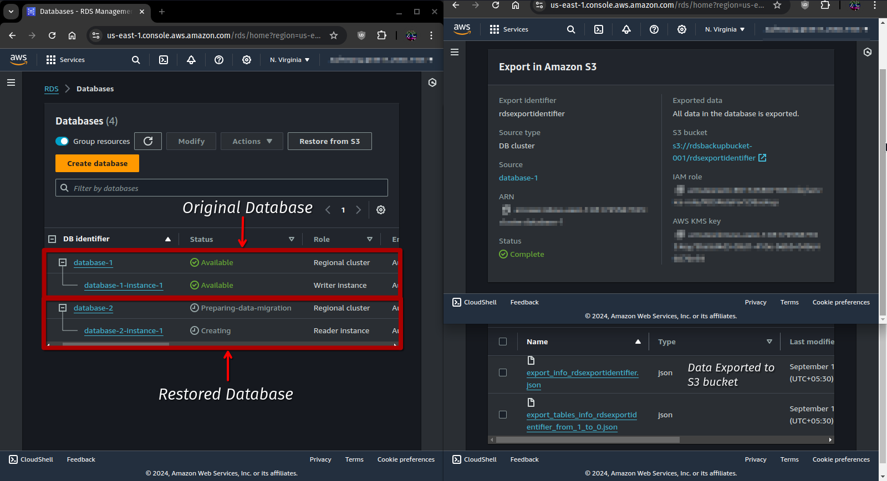

# DBS03-AWS201 - SQLServer Native Backup and Restore on RDS

## Cloud Service Provider
- Amazon Web Services

## Difficulty
- Level 200 (Intermediate)

## Project's Author(s)
- [Jagan](https://twitter.com/JAG2wt)

## Objectives
### You need to complete the following:
- Enable native backup and restore on RDS
- Take native SQL Server backup to S3 bucket 
- Restore native backup from S3 bucket

### You need to answer the following:
### ***How to migrate database from on-prem to RDS?***

Migrating a database from an on-premises environment to Amazon RDS involves several steps to ensure a smooth transition

**Steps:**
- **Step 1: Select the Database Engine**

Before starting the migration, choose the appropriate Amazon RDS database engine, such as MySQL, PostgreSQL, MariaDB, SQL Server, or Oracle, based on your on-premises environment.

- **Step 2: Create an RDS Instance**

  - Go to the AWS Management Console.
  - Navigate to **RDS** and select **Create Database**.
  - Choose the database engine, version, instance class, and other configurations (like storage, networking, and security groups).

- **Step 3: Enable RDS to Receive Data**

  - Ensure that the target RDS instance is configured with a security group that allows connections from your on-premises network.
  - Set up Virtual Private Cloud (VPC) peering or VPN/Direct Connect to establish secure connectivity between your on-premises environment and AWS.

- **Step 4: Export Database from On-Premises**
Depending on your database engine, export the data in the appropriate format:

  - For MySQL: Use ```mysqldump```.
  - For PostgreSQL: Use ```pg_dump```.
  - For SQL Server: Use native backups or **AWS Database Migration** Service (AWS DMS).
  - For Oracle: Use **Oracle Data Pump** or direct export.

- **Step 5: Use AWS DMS (Optional but Recommended)**

AWS Database Migration Service (AWS DMS) can help simplify and automate the migration process, including data replication. You can configure DMS with the on-prem database as the source and the RDS instance as the target, with the option of full-load and continuous replication.

- **Step 6: Import Data into RDS**
After exporting, import the data into your RDS instance:
  - For MySQL/PostgreSQL: Use ```mysql``` or ```psql``` commands to restore the data.
  - For SQL Server: Restore the database from the exported backup (more details in the next section).
  - AWS DMS can also be used to perform ongoing data replication to keep both environments in sync until you cut over.

- **Step 7: Test and Verify**

After migration, verify the data integrity and application functionality in the new RDS environment.

### ***How to restore database from native SQL Server backup?***

Amazon RDS for SQL Server supports native backups, allowing you to restore databases from ```.bak``` files, which is the native backup format for SQL Server.

**Steps to Restore SQL Server Backup:**

- **Step 1: Upload the Backup File to Amazon S3**
  - Upload the ```.bak``` file from your on-premises environment to an Amazon S3 bucket.
  - Ensure the S3 bucket is in the same AWS Region as the RDS instance.

- **Step 2: Grant RDS Permissions to Access the S3 Bucket**
  - Create an IAM role that allows Amazon RDS to access the S3 bucket.
  - Attach this IAM role to your SQL Server RDS instance.

- **Step 3: Use the RDS Stored Procedure to Restore**
  - Once the backup file is in S3, use the following SQL stored procedure to restore the database from S3:
  - ```sql
    exec msdb.dbo.rds_restore_database 
     @restore_db_name='YourDatabaseName', 
     @s3_arn_to_restore_from='arn:aws:s3:::YourBucketName/YourBackupFile.bak';

    ```
  - This command initiates the restore process. The ARN in the command should point to the S3 backup file.

- **Step 4: Monitor the Restore Process**
  - To monitor the restore progress, you can use the following command:
  - ```sql
    exec msdb.dbo.rds_task_status 
     @db_name='YourDatabaseName';
    ```
  - Once the restoration completes, verify that the database is restored correctly by connecting to the RDS instance.


### ***How to take manual backup on RDS?***

In Amazon RDS, you can take manual backups in the form of **DB snapshots**. These snapshots are stored in Amazon S3 and can be used to restore your database at any point.

**Steps to Take a Manual Backup (Snapshot):**

- **Step 1: Go to the Amazon RDS Console**
  - Log in to the AWS Management Console.
  - Navigate to **RDS**.

- **Step 2: Select the Database Instance**
  - In the RDS Dashboard, select the database instance that you want to back up.

- **Step 3: Take a Snapshot**
  - Once the instance is selected, click on the Actions dropdown.
  - Select **Take Snapshot**.
  - Provide a name for the snapshot and confirm.

- **Step 4: Monitor the Snapshot Creation**
  - After submitting the request, the snapshot will be created. You can monitor its progress in the **Snapshots** section of the RDS console.
  - Once complete, you will have a backup stored in Amazon S3, which can be used to restore the database to a new RDS instance if necessary.

**Restoring from Manual Backup:**
- Go to the **Snapshots** section, select the snapshot you want to restore, and choose Restore **DB Instance**. This creates a new RDS instance based on that snapshot.

## References
- [How to perform native backups of an Amazon RDS DB instance?](https://aws.amazon.com/premiumsupport/knowledge-center/native-backup-rds-sql-server/)
- [Setting Up for Native Backup and Restore](https://docs.aws.amazon.com/AmazonRDS/latest/UserGuide/SQLServer.Procedural.Importing.html#SQLServer.Procedural.Importing.Native.Enabling)
- [Working With Backups](https://docs.aws.amazon.com/AmazonRDS/latest/UserGuide/USER_WorkingWithAutomatedBackups.html)
- [Running SQL Server Databases on Amazon RDS for SQL Server - AWS Virtual Workshop](https://youtu.be/twOglkIFbXU)
- [Amazon RDS Free Tier](https://aws.amazon.com/rds/free/)

## Costs

- Included in the Free Tier

## Estimated time to complete
- 20 minutes

## Tips
- Having database knowledge is an added advantage

## Output

