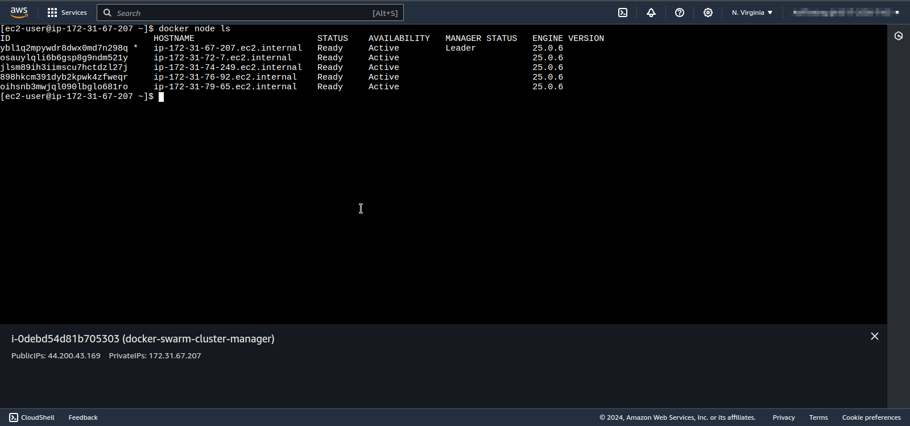
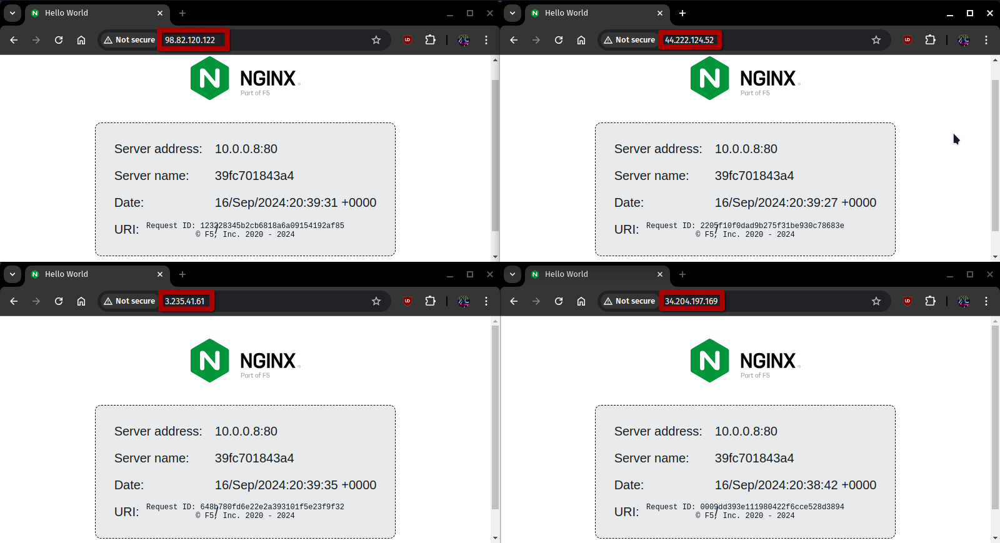

# COM04-AWS400 - Create a Cluster of Virtual Machines Using Docker Swarm

## Cloud Service Provider

- Amazon Web Services

## Difficulty

- Level 400 (Expert)

## Project's Author(s)

[Karan Gauswami](https://github.com/KaranGauswami)

## Objectives

### You need to complete the following:

- Create an EC2 Instance with user data script to install Docker
- Setup that EC2 Instance as a manager node
- Create multiple instances (2 to 3) with user data script to create worker nodes and join them with manager node
- Start any service like nginx to test our Swarm Cluster
- Scale that service to multiple nodes
- Delete all the resources you created after completion

### You need to answer the following:

### ***How to check status of Docker nodes?***

In Docker Swarm, you can check the status of all the nodes in your swarm by running the following command on the manager node:
```bash
docker node ls
```

This command lists all the nodes in the swarm along with their status. The output will show:
- **ID:** Unique identifier of the node.
- **Hostname:** The name of the node.
- **Status:** Whether the node is active (```Ready```) or down (```Down```).
- **Availability:** Indicates whether the node is available to schedule tasks (```Active```, ```Drain```, or ```Pause```).
- **Manager Status:** Shows whether a node is a manager (```Leader```, ```Reachable```), or if it’s a worker (```<empty>```).

### ***What behaviour is expected if one of the worker or manager nodes went down?***

- **Worker node goes down:**
  - If a worker node goes down, Docker Swarm automatically reschedules the containers (tasks) running on the downed worker node onto other active worker nodes, ensuring that the service continues to run without interruption.
  - If no other workers are available, the service on that node will be unavailable until it is either recovered or replaced.

- **Manager node goes down:**
  - If the manager node goes down and there are other manager nodes, the remaining managers continue operating, and the swarm remains functional.
  - If the downed manager was the leader, a new leader will be automatically elected from the remaining managers. You need to ensure that you have an odd number of managers (3, 5, etc.) to maintain quorum.
  - If no manager nodes are available, the swarm loses its ability to manage and schedule tasks, even though the worker nodes might continue running existing tasks. You cannot update the swarm, services, or add new nodes.

### ***How to get state of all the containers running on different nodes?***

To get the state of all containers running across different nodes in a Docker Swarm, you can run the following command on a manager node:

```bash
docker service ps <service-name>
```
or to get the state of all services and their tasks:
```bash
docker service ps --all
```
This will list the tasks (containers) for all services along with their status, node placement, and other information.

To get detailed information for all containers, including their runtime status across all nodes:

```bash
docker ps --all
```
This command will only show the containers on the current node. To check containers across all nodes, you need to use ```docker service ps``` or run ```docker ps``` on each worker node separately, which may not be as practical in a large cluster.

### ***How to get token to add more workers and managers?***

To get the token to add more worker or manager nodes to the swarm, you need to run the following commands on a manager node:

- **For adding a worker node:**
  ```bash
  docker swarm join-token worker
  ```
  This command will output a token and a ```docker swarm join``` command, which you can use to add a worker node to the swarm.

- **For adding a manager node:**
  ```bash
  docker swarm join-token manager
  ```
  This will output a token and a ```docker swarm join``` command, which is used to add a manager node to the swarm.

**Example output:**
```bash
To add a worker to this swarm, run the following command:

docker swarm join --token <WORKER_TOKEN> <MANAGER_IP>:2377

To add a manager to this swarm, run 'docker swarm join-token manager' and follow the instructions.
```


## References
- [Running commands on your Linux instance at launch](https://docs.aws.amazon.com/AWSEC2/latest/UserGuide/user-data.html)
- [Install Docker](https://docs.docker.com/engine/install/ubuntu/)
- [Get Started with Docker Swarm](https://docs.docker.com/engine/swarm/swarm-tutorial)

## Costs
- Included in the Free Tier

## Estimated time to complete
- 30 minutes

## Tips
- Use t2.micro instances for creating nodes to avoid unexpected charges.
- To add more manager or worker nodes, it is not required to SSH into the new instance. Utilize the "user data" functionality.
- Only allow incoming SSH traffic in security groups for the instances that require it.

## Output
### Output 1

### Output 2

